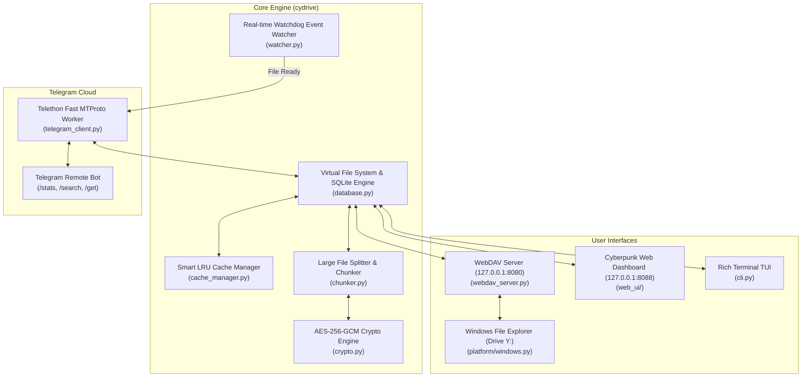

# 🚀 CyDrive

<div align="center">


### **Infinite Cloud Storage Engine & Virtual Drive for Windows via Telegram**
Developed with ❤️ by **[Cynet Security Team](https://cynetx.ir)**

[](https://github.com/icynetx/CyDrive)
[](https://python.org)
[-26A5E4?logo=telegram&logoColor=white&style=for-the-badge)](https://telegram.org)
[](https://en.wikipedia.org/wiki/WebDAV)
[](http://127.0.0.1:8088)
[](LICENSE)

[English](#-about-cydrive) • [فارسی](#-درباره-cydrive) • [Features](#-features) • [Installation](#-installation--quick-start) • [CLI Commands](#-cli-commands) • [Web Dashboard](#-cyberpunk-web-dashboard) • [Troubleshooting](#-windows-webdav-size-limit-fix)

</div>

---

## 📖 About CyDrive

**CyDrive** is a production-grade virtual cloud drive and two-way synchronization bridge. It seamlessly converts Telegram's free, unlimited cloud infrastructure into a **Native Windows Network Drive (e.g. `Y:` or `Z:`)** using **WebDAV**, accompanied by an SQLite Virtual File System (VFS), real-time file event watcher, smart on-demand caching, zero-knowledge encryption, and a built-in modern Cyberpunk Web Dashboard.

---

## ✨ Features (v2.0 Ecosystem)

- 🔄 **Real-Time Two-Way Sync:**
  - Files dropped into your Windows Drive (`Y:`) are verified for lock completion and uploaded to Telegram.
  - Files sent to your Telegram Bot are instantly indexed and synced.
- 📁 **Native Windows Explorer Drive with Auto-Mount:**
  - Automatically configures Windows registry and mounts drive `Y:` on launch with zero manual setup.
- 🌐 **Cyberpunk Web Dashboard (`http://127.0.0.1:8088`):**
  - Modern dark glassmorphism interface with storage analytics, drag-and-drop uploader, instant search, and built-in video/audio/image streaming media player.
- 🗄️ **SQLite Hierarchical VFS Engine:**
  - Full support for nested folders, subdirectories, path preservation, and millisecond queries.
- 👁️ **Event-Driven File Watcher (`watchdog`):**
  - Zero high-CPU polling. Debounced event listener with file stability checks (`is_file_ready`) before uploading.
- 🧩 **Large File Chunking (>2GB Limit Bypass):**
  - Seamlessly splits massive files into parts and stitches them back on download.
- 🤖 **Interactive Telegram Remote Bot:**
  - Remote commands: `/stats`, `/search <query>`, `/get <filename>`, `/help`.
- 🔐 **Zero-Knowledge AES-256-GCM Encryption (Optional):**
  - Client-side end-to-end encryption for sensitive data.

---

## 🏗️ Architecture



---

## 📦 Installation & Quick Start

### 1. Prerequisites
- **Python 3.8+** installed.
- Telegram Bot Token (from [@BotFather](https://t.me/BotFather)) & Chat ID (from [@userinfobot](https://t.me/userinfobot)).

### 2. Clone & Install
```bash
git clone https://github.com/icynetx/CyDrive.git
cd CyDrive
pip install -r requirements.txt
```

### 3. Launch CyDrive
```bash
python main.py
```
> On the first launch, the interactive wizard will ask for your Bot credentials, setup `config.json`, launch WebDAV (`:8080`), start the Web Dashboard (`:8088`), and auto-mount your Windows drive `Y:`.

---

## 💻 CLI Commands

CyDrive comes with a unified command-line tool:

| Command | Description |
|---|---|
| `python main.py run` | Start all services (WebDAV, Telegram Sync, Web Dashboard, Auto-Mount) |
| `python main.py mount` | Mount CyDrive as a Windows Network Drive letter |
| `python main.py unmount` | Safely disconnect the Windows Network Drive |
| `python main.py fix-reg` | Optimize Windows WebDAV registry (removes 50MB file size limit) |
| `python main.py stats` | Display storage usage and database metrics |
| `python main.py setup` | Rerun the interactive credential configuration wizard |

---

## 🌐 Cyberpunk Web Dashboard

Once CyDrive is running, open your browser and navigate to:
```text
http://127.0.0.1:8088
```

Features included in the Web Dashboard:
- 📊 Real-time storage gauge and cloud file counts.
- 📁 Interactive file table with size, status badges, and direct downloads.
- 🎬 Built-in media streaming modal (video, audio, image viewer).
- 📤 Drag-and-drop instant upload zone.
- 🔍 Live search filtering across your entire cloud drive.

---

## ⚙️ Windows WebDAV File Size Limit Fix

By default, Windows WebDAV client limits single file transfers to **50 MB**. You can fix this with one command:
```bash
python main.py fix-reg
```
*(Or run PowerShell as Administrator)*:
```powershell
Set-ItemProperty -Path "HKLM:\SYSTEM\CurrentControlSet\Services\WebClient\Parameters" -Name "FileSizeLimitInBytes" -Value 4294967295 -Type DWord
Restart-Service WebClient
```

---

## 📁 Project Structure

```text
CyDrive/
├── cydrive/
│   ├── __init__.py
│   ├── cli.py                  # Rich CLI interface & service coordinator
│   ├── config.py               # Robust configuration dataclass & loader
│   ├── database.py             # SQLite VFS metadata manager
│   ├── crypto.py               # Zero-Knowledge AES-256-GCM encryption
│   ├── chunker.py              # Large file chunking & reassembly
│   ├── telegram_client.py      # Telethon MTProto engine & bot commands
│   ├── watcher.py              # Watchdog real-time file sync watcher
│   ├── cache_manager.py        # Smart on-demand LRU cache
│   ├── webdav_server.py        # Custom WebDAV VFS provider
│   ├── web_ui/                 # Cyberpunk Web Dashboard
│   │   ├── app.py              # aiohttp Web server
│   │   ├── static/             # CSS & JS
│   │   └── templates/index.html# Modern responsive dashboard
│   └── platform/
│       └── windows.py          # Auto registry tuner & drive mapper
├── main.py                     # Primary entrypoint
├── tgdrive.py                  # Backward-compatible entrypoint
├── requirements.txt            # Python dependencies
├── config.example.json         # Config schema
├── .gitignore                  # Git rules
├── LICENSE                     # MIT License
└── README.md                   # Documentation
```

---

## 🇮🇷 درباره CyDrive (فارسی)

نسخه ۲ پروژه **CyDrive** یک اکوسیستم کامل ذخیره‌سازی ابری مجازی و بدون محدودیت بر بستر تلگرام است:
* **درایو بومی ویندوز:** بدون نیاز به نصب درایورهای جانبی، تلگرام به عنوان درایو تحت شبکه `Y:` در ویندوز اکسپلورر متصل می‌شود.
* **داشبورد وب سایبرپانکی:** پنل کاربری مدرن تحت وب روی پورت `8088` با قابلیت پخش آنلاین ویدیو، صوت و تصاویر، جستجوی آنی و آپلود کشیدنی-رهاکردنی (Drag & Drop).
* **بهینه‌سازی حداکثری سرعت و منابع:** استفاده از `watchdog` رویدادمحور به جای مصرف مداوم پردازنده، دیتابیس SQLite برای پوشه‌بندی و جلوگیری از کپی ناقص فایل‌های حجیم.
* **پشتیبانی از فایل‌های سنگین:** امکان تقسیم و آپلود فایل‌های با حجم بالا و رفع خودکار محدودیت‌های رجیستری ویندوز.

---

## 🤝 Contributing

Contributions, bug reports, and feature requests are welcome!
1. Fork the Project
2. Create your Feature Branch (`git checkout -b feature/AmazingFeature`)
3. Commit your Changes (`git commit -m 'Add some AmazingFeature'`)
4. Push to the Branch (`git push origin feature/AmazingFeature`)
5. Open a Pull Request

---

## 🛡️ License

Distributed under the **MIT License**. See [`LICENSE`](LICENSE) for more information.

---

## 🌐 Connect with Us

- **Organization:** [Cynet Security Team](https://cynetx.ir)
- **GitHub:** [@icynetx](https://github.com/icynetx)
- **Repository:** [https://github.com/icynetx/CyDrive](https://github.com/icynetx/CyDrive)
- **Contact:** [heyfiranam@gmail.com](mailto:heyfiranam@gmail.com)
