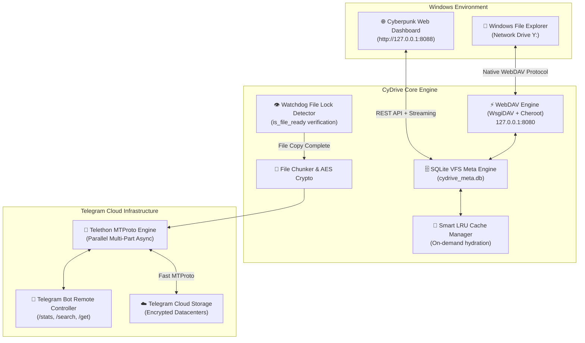

# 🚀 سای‌درایو (CyDrive)

<div align="center">


### **تبدیل تلگرام به هارد دیسک ابری نامحدود و درایو بومی ویندوز**
*توسعه‌داده‌شده توسط تیم امنیت سایبری ساینت (**[Cynet Security Team](https://cynetx.ir)***)

[](https://github.com/icynetx/CyDrive/stargazers)
[](https://python.org)
[](https://telegram.org)
[](https://en.wikipedia.org/wiki/WebDAV)
[-00f3ff?style=for-the-badge)](http://127.0.0.1:8088)
[](LICENSE)

[🌐 English Documentation (English Version)](README_EN.md) • [چرا CyDrive؟](#-چرا-cydrive) • [قابلیت‌های کلیدی](#-امکانات-و-قابلیت‌های-برجسته) • [آموزش ۰ تا ۱۰۰ راه‌اندازی](#-آموزش-گام‌به‌گام-۰-تا-۱۰۰-راه‌اندازی) • [داشبورد وب](#-داشبورد-تحت-وب-سایبرپانکی) • [دستورات ترمینال](#-دستورات-خط-فرمان-cli) • [سوالات متداول و عیب‌یابی](#-سوالات-متداول-و-عیب‌یابی-faqs)

</div>

---

## 💡 چرا CyDrive؟

بیایید واقع‌بین باشیم: **اشتراک‌های سرویس‌های ابری خارجی (مثل گوگل‌درایو، دراپ‌باکس و وان‌درایو) بسیار گران هستند و حجم‌های رایگان آن‌ها به شکلی خنده‌دار کم است!**
گوگل‌درایو فقط ۱۵ گیگابایت فضای اشتراکی با جیمیل می‌دهد، دراپ‌باکس فقط ۲ گیگابایت حجم دارد و برای پلن‌های چند ترابایتی باید ماهانه هزینه‌های سنگین دلاری پرداخت کنید.

در سوی دیگر، **سرورهای قدرتمند تلگرام، فضای ابری نامحدود، پرسرعت، رایگان و فوق‌العاده پایداری را در اختیار کاربران قرار داده‌اند.**
اما استفاده سنتی از تلگرام به عنوان درایو ابری همیشه یک کابوس خسته‌کننده بود:
- ریختن فایل‌ها در «پیام‌های ذخیره‌شده (Saved Messages)» چت شما را به یک انبار بی‌نظم، شلوغ و غیرقابل‌جستجو تبدیل می‌کرد.
- هیچ ساختار پوشه‌بندی درختی (Folder / Subfolder) در تلگرام وجود نداشت.
- برای هر بار استفاده یا مشاهده فایل‌ها، باید برنامه تلگرام را باز کرده و فایل‌ها را به صورت دستی دانلود و در ویندوز ذخیره می‌کردید.

**پروژه CyDrive این معضل را یک‌بار برای همیشه حل کرده است.** این نرم‌افزار، چت تلگرام شما را مستقیماً به یک **درایو هارد دیسک واقعی در ویندوز (مانند درایو `Y:`)** تبدیل می‌کند!

فقط کافیست یک پوشه حجیم را با موس بکشید و داخل درایو `Y:` ویندوز رها کنید؛ CyDrive ساختار پوشه‌ها را در دیتابیس هوشمند SQLite ثبت کرده و فایل‌ها را با پروتکل پرسرعت MTProto در تلگرام آپلود می‌کند. همچنین اگر بیرون از منزل باشید و با گوشی عکسی را به ربات تلگرام خود بفرستید، به محض بازگشت به خانه، آن عکس بدون نیاز به هیچ کابل یا نرم‌افزار جانبی داخل درایو `Y:` کامپیوترتان آماده استفاده است — **همه‌چیز بدون اشغال حتی ۱ بایت از فضای هارد دیسک فیزیکی سیستم شما!**

---

## ⚡ مقایسه جامع: چرا CyDrive بی‌رقیب است؟

| قابلیت | 📁 CyDrive (نسخه ۲) | 📦 Google Drive / Dropbox | 💬 تلگرام ساده (Saved Messages) |
|---|---|---|---|
| **ظرفیت ذخیره‌سازی** | **نامحدود و رایگان (Unlimited)** | ۲ تا ۱۵ گیگابایت (رایگان) | نامحدود و رایگان |
| **ادغام در This PC ویندوز** | **درایو اختصاصی مستقل (`Y:`)** | نیازمند نرم‌افزارهای سنگین سینک | ❌ ندارد (فقط درون چت تلگرام) |
| **استریم ابری بدون پر شدن هارد** | ✅ استریم زنده (Zero-Disk Bloat) | ⚠️ نیازمند پلن‌های پولی (Smart Sync) | ❌ باید کل فایل دانلود شود |
| **حداکثر حجم هر فایل** | **۲ گیگابایت (یا نامحدود با قابلیت Chunking)** | ۱۵ گیگابایت (رایگان) / ۵ ترابایت | ۲ گیگابایت (۴ گیگ در پریمیوم) |
| **پوشه‌بندی درختی و تودرتو** | ✅ دیتابیس سلسله‌مراتبی SQLite | ✅ دارد | ❌ ندارد (جریان چت خطی) |
| **نیاز به درایورهای سنگین کرنل** | ❌ **خیر (WebDAV بومی ویندوز)** | ⚠️ بله (درایورهای مجازی فایل‌سیستم) | ❌ خیر |
| **پنل وب اختصاصی با پلیر مدیا** | ✅ داشبورد سایبرپانکی مدرن (`:8088`) | ✅ پنل وب استاندارد | ⚠️ فقط پلیر داخلی تلگرام |
| **رمزنگاری سمت کاربر (Zero-Knowledge)** | ✅ اختیاری با الگوریتم AES-256-GCM | ❌ رمزنگاری اختصاصی سمت سرور | ⚠️ پروتکل MTProto سرور |

---

## ✨ امکانات و قابلیت‌های برجسته

- 🔄 **همگام‌سازی دوطرفه بلادرنگ (Two-Way Sync):**
  - فایل یا پوشه‌ای را داخل درایو `Y:` ویندوز کپی کنید $\rightarrow$ بلافاصله در پس‌زمینه به تلگرام آپلود می‌شود.
  - فایلی را در تلگرام برای ربات بفرستید $\rightarrow$ بلافاصله در درایو `Y:` و پنل وب ظاهر می‌شود.
- 📁 **درایو مجازی بومی ویندوز (`Y:`):**
  - در کنار درایوهای `C:` و `D:` در پنجره **This PC** ویندوز اکسپلورر دیده می‌شود.
  - هنگام اجرای برنامه خودکار متصل (Mount) و هنگام خروج بدون دردسر جدا (Unmount) می‌شود.
- 🌐 **داشبورد تحت وب سایبرپانکی (`http://127.0.0.1:8088`):**
  - رابط کاربری مدرن با تم تاریک، انیمیشن‌های شیشه‌ای (Glassmorphism)، عقربه حجم مصرفی و آمار لحظه‌ای.
  - **پخش آنلاین مدیا:** تماشای فیلم‌های MP4، گوش دادن به موزیک‌های FLAC/MP3 و نمایش عکس‌ها داخل مرورگر بدون نیاز به دانلود کل فایل!
  - کادر آپلود با قابلیت کشیدن و رها کردن (Drag & Drop) و جستجوی آنی در میان فایل‌ها.
- 🗄️ **موتور فراداده فوق‌سریع SQLite WAL:**
  - ثبت ساختار درختی پوشه‌ها، هش SHA-256 فایل‌ها و شناسه‌های پیام در تلگرام.
  - جستجو و فیلتر میان صدها هزار فایل در کسری از میلی‌ثانیه.
- 👁️ **مانیتورینگ رویدادهای فایل‌سیستم با `watchdog`:**
  - مصرف نزدیک به صفر پردازنده (بدون استفاده از حلقه‌های سنگین `os.walk`).
  - مجهز به الگوریتم بررسی پایداری و باز بودن فایل (`is_file_ready`): تا زمانی که کپی فایل‌های سنگین در ویندوز کامل نشود، آپلود آغاز نمی‌شود تا فایل ناقص ذخیره نگردد.
- 🧩 **تقسیم خودکار فایل‌های بسیار حجیم (Chunking بالای ۲ گیگابایت):**
  - امکان آپلود و نگهداری فایل‌های سنگین (۵، ۲۰ یا ۵۰ گیگابایت) با تقسیم خودکار به پارت‌های استاندارد و اسمبل نامرئی هنگام دانلود.
- 🤖 **ربات هوشمند کنترل از راه دور:**
  - دستور `/stats` $\rightarrow$ گزارش حجم کل ابری و تعداد فایل‌های ذخیره‌شده.
  - دستور `/search <نام_فایل>` $\rightarrow$ جستجوی سریع در دیتابیس درایو.
  - دستور `/get <نام_فایل>` $\rightarrow$ دانلود مستقیم هر فایلی از روی گوشی.
- 🔐 **رمزنگاری امن سمت کلاینت (اختیاری):**
  - رمزنگاری فوق‌العاده امن سرتاسری با استاندارد نظامی AES-256-GCM؛ فایل‌ها پیش از خروج از کامپیوتر رمزگذاری می‌شوند و حتی تلگرام هم محتوای آن‌ها را نمی‌بیند.

---

## 🏗️ معماری و سازوکار درونی سیستم



---

## 🚀 آموزش گام‌به‌گام ۰ تا ۱۰۰ راه‌اندازی

برای راه‌اندازی CyDrive فقط به ۵ دقیقه زمان نیاز دارید. مراحل زیر را به ترتیب دنبال کنید:

### گام ۱: ساخت ربات و دریافت توکن تلگرام (کمتر از ۱ دقیقه)
1. برنامه تلگرام را باز کنید و وارد ربات رسمی **[BotFather@](https://t.me/BotFather)** شوید.
2. دکمه **Start** را بزنید و سپس دستور `/newbot` را ارسال کنید.
3. یک **نام نمایشی** برای ربات خود بنویسید (مثلاً: `My Personal Drive`).
4. یک **یوزرنیم یکتا** که آخر آن عبارت `bot` داشته باشد انتخاب کنید (مثلاً: `MyCloud_Fast_bot`).
5. ربات BotFather یک توکن با ساختار زیر به شما تحویل می‌دهد:
   ```text
   7123456789:ABCdefGhIJKlmNoPQRstuVWXyz_123456
   ```
   این توکن را کپی کنید و در جایی نگه دارید.

### گام ۲: دریافت شناسه کاربری (Chat ID)
1. در تلگرام وارد ربات **[userinfobot@](https://t.me/userinfobot)** شوید و دکمه **Start** را بزنید.
2. این ربات یک پیام حاوی شناسه عددی اکانت شما (مانند `123456789`) ارسال می‌کند. این عدد، همان **Chat ID** شماست.
3. در نهایت، وارد چت ربات جدیدی که در گام اول ساختید شوید و روی دکمه **Start** کلیک کنید تا ربات اجازه ارسال پیام به شما را داشته باشد.

### گام ۳: دانلود پروژه و نصب پکیج‌ها
ترمینال ویندوز (PowerShell یا Command Prompt) را باز کرده و دستورات زیر را وارد کنید:

```bash
# کلون کردن پروژه از گیت‌هاب
git clone https://github.com/icynetx/CyDrive.git

# ورود به پوشه پروژه
cd CyDrive

# نصب پکیج‌های مورد نیاز
pip install -r requirements.txt
```

### گام ۴: اجرای جادویی CyDrive
دستور زیر را در ترمینال وارد کنید:

```bash
python main.py
```

* **در اولین اجرا چه رخ می‌دهد؟**
  1. بنر شیک ساینت نمایش داده می‌شود.
  2. برنامه از شما **Bot Token** و سپس **Chat ID** را می‌پرسد.
  3. حرف درایو مورد نظر (پیش‌فرض `Y:`) را انتخاب می‌کنید.
  4. برنامه به طور خودکار اطلاعات را در `config.json` ذخیره می‌کند، سرورهای لازم را بالا می‌آورد، درایو `Y:` را در ویندوز ماونت می‌کند و پنل وب را استارت می‌زند!

---

## 🌐 داشبورد تحت وب سایبرپانکی

پس از اجرای برنامه، مرورگر خود را باز کرده و وارد نشانی زیر شوید:
👉 **`http://127.0.0.1:8088`**

```text
┌────────────────────────────────────────────────────────────────────────────┐
│  [■] CyDrive v2.0 • CYNET ENGINE                  [ جستجوی فایل‌ها... ] 🔍 │
├────────────────────────────────────────────────────────────────────────────┤
│  📊 تعداد فایل‌ها: ۱,۴۲۰    |  ☁️ حجم مصرفی: ۴۲.۸ GB  |  🟢 وضعیت تلگرام: آنلاین │
├────────────────────────────────────────────────────────────────────────────┤
│  [       فایل‌ها را به این قسمت بکشید و رها کنید تا در تلگرام آپلود شوند       ]   │
├────────────────────────────────────────────────────────────────────────────┤
│  📄 Project_Final.mp4     │  ۱.۴۲ GB  │  🟢 سینک‌شده │  [پخش آنلاین] [دانلود] │
│  📁 Source_Code_Archive   │  ۳۲۰ MB   │  🟢 سینک‌شده │  [باز کردن]   [دانلود] │
│  🖼️ Screenshot_2026.png   │  ۴.۱ MB   │  🟢 سینک‌شده │  [مشاهده]     [دانلود] │
└────────────────────────────────────────────────────────────────────────────┘
```

---

## 💻 دستورات خط فرمان (CLI)

پروژه CyDrive دارای یک ابزار مدیریت جامع خط فرمان است:

| دستور | توضیح عملکرد |
|---|---|
| `python main.py run` | اجرای کامل تمام سرویس‌ها (WebDAV، تلگرام، پنل وب و ماونت خودکار درایو) |
| `python main.py mount` | اتصال و ماونت درایو شبکه ویندوز (مانند درایو `Y:`) |
| `python main.py unmount` | قطع اتصال و حذف ایمن درایو شبکه از ویندوز اکسپلورر |
| `python main.py fix-reg` | بهینه‌سازی خودکار رجیستری ویندوز برای حذف محدودیت ۵۰ مگابایتی WebDAV (تا ۴ گیگابایت) |
| `python main.py stats` | نمایش سریع آمار حجم ابری، تعداد فایل‌ها و وضعیت دیتابیس در ترمینال |
| `python main.py setup` | اجرای مجدد ویزارد تعاملی دریافت و ویرایش توکن و تنظیمات |

---

## ❓ سوالات متداول و عیب‌یابی (FAQs)

<details>
<summary><strong>س: هنگام انتقال فایل‌های بالای ۵۰ مگابایت در ویندوز، ارور «File size exceeds the limit allowed» می‌گیرم. راه‌حل چیست؟</strong></summary>

کلاینت WebDAV پیش‌فرض ویندوز به صورت کارخانه‌ای انتقال تک‌فایل‌ها را به ۵۰ مگابایت محدود کرده است. 
برای حذف کامل این محدودیت، کافیست فقط یک‌بار دستور زیر را در ترمینال اجرا کنید:
```bash
python main.py fix-reg
```
*(یا پاورشل را در حالت Run as Administrator باز کرده و دستور `Set-ItemProperty -Path "HKLM:\SYSTEM\CurrentControlSet\Services\WebClient\Parameters" -Name "FileSizeLimitInBytes" -Value 4294967295 -Type DWord` را بزنید و سرویس WebClient را ری‌استارت کنید).*
</details>

<details>
<summary><strong>س: آیا این برنامه هارد کامپیوتر من (درایو C) را پر می‌کند؟</strong></summary>

**خیر، به هیچ وجه!** معماری CyDrive بر پایه **سیستم فایل مجازی ابری (Zero-Disk Cloud Streaming)** طراحی شده است. تمام فایل‌های شما فقط در تلگرام ذخیره می‌شوند و در دیتابیس محلی فقط شناسه‌ها و حجم آن‌ها ایندکس می‌شود (۰ بایت اشغال هارد). تنها در زمان باز کردن یا پخش یک فایل، بایت‌های آن به صورت زنده و آنلاین استریم می‌شوند!
</details>

<details>
<summary><strong>س: آیا اکانت تلگرام من به دلیل استفاده از این ابزار بن (مسدود) می‌شود؟</strong></summary>

**خیر.** این ابزار از توکن رسمی بات تلگرام و کلاینت استاندارد MTProto بر پایه کتابخانه محبوب Telethon استفاده می‌کند. تمام محدودیت‌های نرخ ارسال تلگرام (FloodWait) رعایت شده و رفتار برنامه کاملاً استاندارد و قانونی است.
</details>

<details>
<summary><strong>س: اگر در حین آپلود اتصال اینترنت قطع شود چه اتفاقی می‌افتد؟</strong></summary>

موتور SQLite تمام وضعیت فایل‌ها را ثبت می‌کند. به محض برقراری مجدد اینترنت، پردازش فایل‌های آپلود‌نشده از همان نقطه ادامه می‌یابد.
</details>

---

## 📁 ساختار فایل‌های پروژه

```text
CyDrive/
├── cydrive/
│   ├── __init__.py             # اطلاعات ماژول و نگارش بسته
│   ├── cli.py                  # رابط خط فرمان رنگی، هماهنگ‌کننده و جدول وضعیت
│   ├── config.py               # مدیریت تنظیمات، اعتبارسنجی و ویزارد هوشمند
│   ├── database.py             # موتور فراداده سلسله‌مراتبی SQLite در حالت WAL
│   ├── crypto.py               # موتور رمزنگاری سرتاسری AES-256-GCM
│   ├── chunker.py              # ماژول تقسیم فایل‌های حجیم بالای ۲ گیگابایت
│   ├── telegram_client.py      # کلاینت ناهمگام MTProto تلگرام و کنترلر ربات
│   ├── watcher.py              # مانیتورینگ رویدادهای زنده فایل سیستم و قفل فایل
│   ├── cache_manager.py        # سیستم کش هوشمند بر اساس تقاضا (LRU Cache)
│   ├── webdav_server.py        # سرور درایو مجازی WebDAV
│   ├── web_ui/                 # داشبورد تحت وب سایبرپانکی
│   │   ├── app.py              # سرور سبک aiohttp و وب‌سرویس REST
│   │   ├── static/             # استایل‌های شیک CSS و کدهای تعاملی JS
│   │   └── templates/index.html# قالب واکنش‌گرای پنل وب
│   └── platform/
│       └── windows.py          # تنظیمات رجیستری و ماونتر خودکار درایو ویندوز
├── main.py                     # نقطه ورود اصلی برنامه
├── tgdrive.py                  # فایل ورود سازگار با نسخه‌های قبلی
├── requirements.txt            # پکیج‌های پیش‌نیاز پایتون
├── config.example.json         # نمونه فایل کانفیگ
├── .gitignore                  # قوانین نادیده‌گیری فایل‌های محلی در گیت
├── LICENSE                     # لایسنس متن‌باز MIT
├── README.md                   # مستندات کامل فارسی
└── README_EN.md                # مستندات کامل انگلیسی
```

---

## 🤝 مشارکت در توسعه (Contributing)

از هرگونه مشارکت، گزارش باگ یا افزودن قابلیت‌های جدید با آغوش باز استقبال می‌کنیم!
1. ریپازیتوری را Fork کنید.
2. شاخه ویژگی خود را بسازید (`git checkout -b feature/NewFeature`).
3. تغییرات را کامیت کنید (`git commit -m 'feat: Add NewFeature'`).
4. به شاخه خود پوش کنید (`git push origin feature/NewFeature`).
5. یک Pull Request ایجاد نمایید.

---

## 🛡️ پروانه و لایسنس

این پروژه تحت مجوز **MIT License** منتشر شده است. برای جزئیات بیشتر به فایل [`LICENSE`](LICENSE) مراجعه کنید.

---

## 🌐 ارتباط با ما و تیم توسعه

- **توسعه‌داده‌شده توسط:** [تیم امنیت سایبری ساینت (Cynet Security Team)](https://cynetx.ir)
- **گیت‌هاب رسمی:** [@icynetx](https://github.com/icynetx)
- **ریپازیتوری پروژه:** [https://github.com/icynetx/CyDrive](https://github.com/icynetx/CyDrive)
- **پشتیبانی و ایمیل:** [heyfiranam@gmail.com](mailto:heyfiranam@gmail.com)
