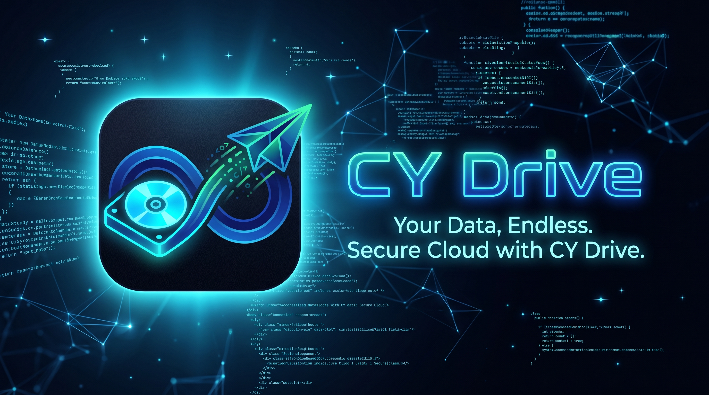
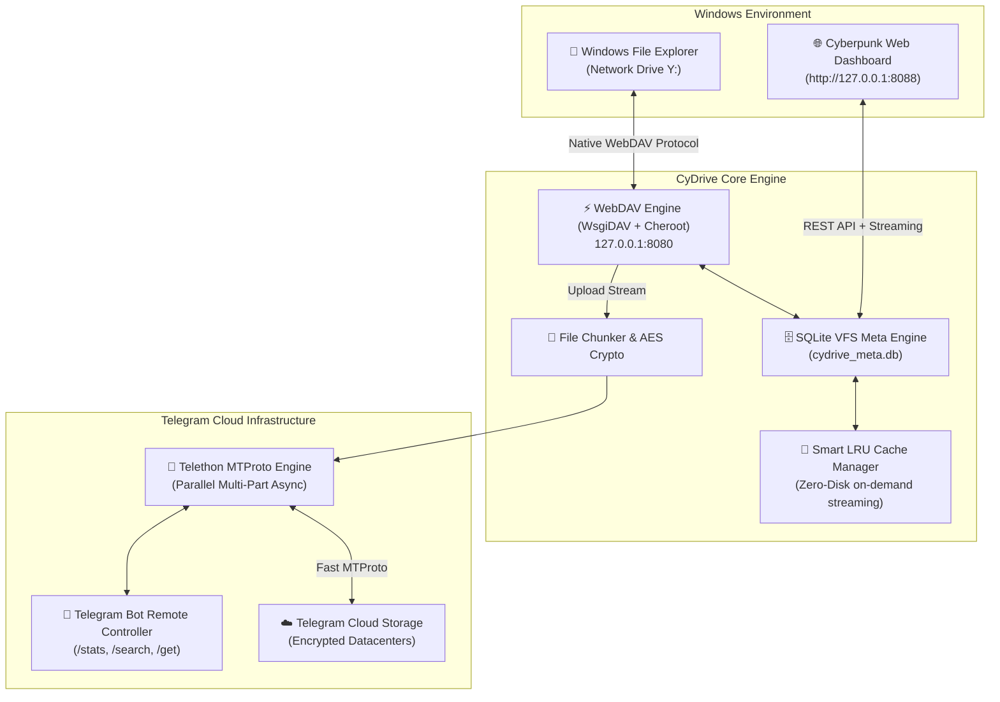
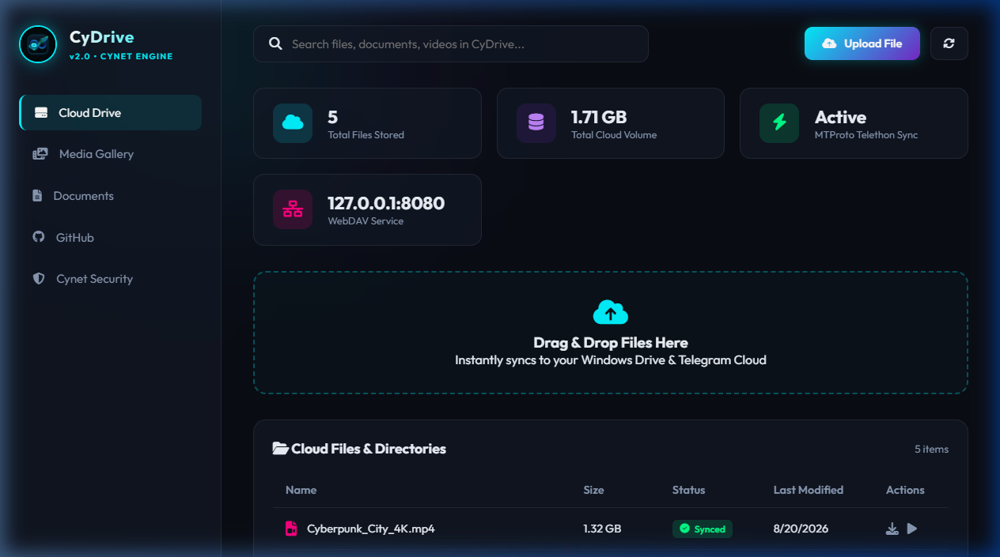
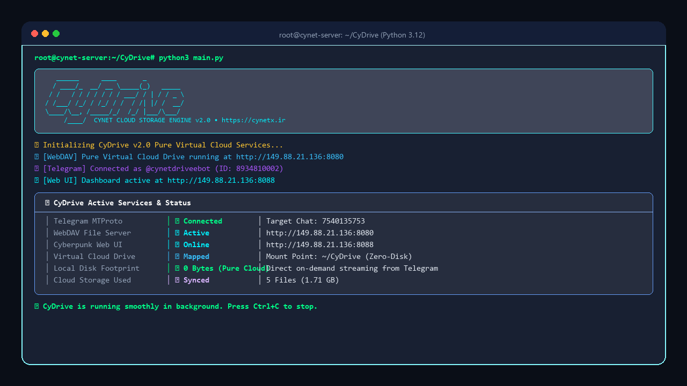

# 🚀 CyDrive

<div align="center">



### **把 Telegram 變成無限容量、Windows 原生掛載的雲端硬碟**
*由 **[Cynet Security Team](https://cynetx.ir)** 開發*

[](https://github.com/thecynetx/CyDrive)
[](https://python.org)
[](https://telegram.org)
[](https://en.wikipedia.org/wiki/WebDAV)
[-00f3ff?style=for-the-badge)](http://127.0.0.1:8088)
[](LICENSE)

[📖 فارسی (波斯文)](README.fa.md) • [📖 English](README_EN.md) • [📖 简体中文](README.zh-CN.md)

</div>

---

## 💡 為什麼選擇 CyDrive?

說實話:**國外雲端服務(Google Drive、Dropbox、OneDrive)的訂閱很貴,免費容量又少得可憐。**
Google Drive 只給 15 GB(還跟 Gmail 共用),Dropbox 只有 2 GB,想要 TB 級空間每個月都得付高額費用。

另一方面,**Telegram 的伺服器提供了幾乎無限、免費、高速且極為穩定的雲端空間。**
但傳統上用 Telegram 當雲端硬碟一直很麻煩:
- 把檔案丟進「收藏夾(Saved Messages)」會讓聊天室變成雜亂、無法搜尋的倉庫。
- Telegram 沒有樹狀資料夾結構(Folder / Subfolder)。
- 每次要用檔案都得打開 Telegram、手動下載、再存到電腦。

**CyDrive 徹底解決了這個問題。** 它把你的 Telegram 直接變成 **Windows 裡一個真正的磁碟機(例如 `Y:`)**!

只要把資料夾拖進 `Y:`,CyDrive 就會把目錄結構記錄到智慧型 SQLite 資料庫,並透過高速 MTProto 協定上傳到 Telegram。如果你人在外面,用手機把照片傳給機器人,回家時照片已經躺在電腦的 `Y:` 裡——**全程不佔用你硬碟的任何 1 Byte!**

---

## ⚡ 完整比較:為什麼 CyDrive 無可取代?

| 功能 | 📁 CyDrive(v2.0) | 📦 Google Drive / Dropbox | 💬 原生 Telegram(收藏夾) |
|---|---|---|---|
| **儲存容量** | **無限且免費(Unlimited)** | 2 ~ 15 GB(免費) | 無限且免費 |
| **整合進 Windows 本機** | **獨立磁碟機代號(`Y:`)** | 需要笨重的同步軟體 | ❌ 沒有(只能在聊天室裡看) |
| **雲端串流不佔硬碟** | ✅ 即時串流(Zero-Disk) | ⚠️ 需付費方案(Smart Sync) | ❌ 必須整個下載 |
| **單檔大小上限** | **2 GB(Chunking 後無上限)** | 15 GB(免費)/ 5 TB | 2 GB(Premium 4 GB) |
| **樹狀巢狀資料夾** | ✅ SQLite 階層式資料庫 | ✅ 有 | ❌ 沒有(線性聊天流) |
| **需要笨重的核心驅動** | ❌ **不需要(Windows 原生 WebDAV)** | ⚠️ 需要(虛擬檔案系統驅動) | ❌ 不需要 |
| **專屬 Web 面板與播放器** | ✅ 賽博龐克風儀表板(`:8088`) | ✅ 標準 Web UI | ⚠️ 只有 Telegram 內建播放器 |
| **用戶端零知識加密** | ✅ 可選 AES-256-GCM | ❌ 伺服器端私有加密 | ⚠️ MTProto 伺服器加密 |

---

## ✨ 核心功能

- 🔄 **即時雙向同步(Two-Way Sync):**
  把檔案複製到 `Y:` → 背景自動上傳 Telegram;在 Telegram 傳檔案給機器人 → 立刻出現在 `Y:` 與 Web 面板。
- 📁 **Windows 原生虛擬磁碟(`Y:`):**
  直接顯示在檔案總管的 **This PC / 本機** 中。啟動時自動掛載(Mount),結束時自動卸載(Unmount)。
- 🌐 **賽博龐克 Web 儀表板(`http://127.0.0.1:8088`):**
  深色玻璃擬態(Glassmorphism)介面、容量儀表、即時統計。
  **線上播放媒體:** 在瀏覽器直接看 MP4 影片、聽 FLAC/MP3 音樂、看圖片,不用先下載整個檔案!
- 🗄️ **SQLite WAL 高效能元資料引擎:**
  記錄樹狀目錄結構、SHA-256 雜湊與 Telegram 訊息 ID,在數十萬檔案中搜尋只需不到一毫秒。
- 👁️ **以 `watchdog` 監控檔案系統事件:**
  接近零 CPU 佔用(不使用笨重的 `os.walk` 輪詢),內建檔案穩定性檢查(`is_file_ready`),避免複製到一半就上傳殘缺檔案。
- 🧩 **超大檔案自動分割(Chunking,超過 2 GB):**
  自動把 5 GB、20 GB、50 GB 的大檔切成標準分段上傳,下載時無感重組。
- 🤖 **智慧遠端遙控機器人:**
  - `/stats` 查看雲端總容量與檔案數
  - `/search <檔名>` 快速搜尋雲端硬碟
  - `/get <檔名>` 直接下載檔案到手機
- 🔐 **用戶端加密(可選):**
  採用軍規 AES-256-GCM 端對端加密,檔案離開電腦前就已加密,連 Telegram 都看不到內容。

---

## 🛡️ 安全審計與修正(本 Fork 新增)

> 本 Fork([lp1688/CyDrive](https://github.com/lp1688/CyDrive))對上游 v2.0 全部程式碼進行了逐行安全審計,並修復了發現的漏洞。

### 審計結論:未發現木馬或後門

- 全部約 2,300 行 Python 原始碼、Web 面板的 JS/CSS/HTML 均經人工逐行審查:**沒有混淆代碼、沒有隱藏的資料外洩通道、沒有可疑的 `eval`/`exec`/`pickle`**。
- 對外網路行為只有兩類,皆屬正常:
  - Telegram MTProto(軟體本體功能,經由 Telethon)
  - 查詢本機公網 IP(`api.ipify.org` 等,僅在綁定 `0.0.0.0` 時用來顯示網址)
- 所有子程序呼叫(`sc`、`net use`、`mount` 等)皆為硬編碼指令,無命令注入風險。

### 已修復的漏洞

**1. WebDAV 與 Web 面板完全沒有身份驗證(高風險)**

原本 `webdav_server.py` 以 `{"*": True}` 匿名放行所有人;一旦綁定 `0.0.0.0`(例如 VPS),任何能連到 8080/8088 埠的人都能讀取、上傳、刪除你整個雲端硬碟。

**修復方式:**
- 新增 `web_username` / `web_password` 設定,首次啟動自動產生隨機密碼並寫入 `config.json`
- WebDAV 伺服器啟用 HTTP Basic + Digest 驗證
- Web 面板全部路由(含靜態檔)加入 Basic Auth 中介軟體,使用 `secrets.compare_digest` 防時序攻擊
- Windows `net use` 掛載時自動攜帶憑證,無需手動輸入

**2. Web UI 路徑穿越(Path Traversal)**

原本 `/api/delete`、`/api/upload`、`/api/download` 直接把使用者提供的檔名拼進檔案路徑,`../../` 可以逃逸快取目錄,刪除或覆寫系統上任意檔案。

**修復方式:**
- 新增 `_sanitize_filename()`:先 URL 解碼(攔截 `..%2F`、`%2e%2e%2f` 等混淆寫法),再拒絕任何含 `..` 的路徑段,最後只保留純檔名;非法檔名一律回傳 400
- 已新增對應的自動化測試(未授權存取、三種穿越攻擊)

### 仍需注意的殘留風險

- ⚠️ **上傳失敗會刪除本機快取檔**(`telegram_client.py` 的 Zero-Disk 設計):網路中斷導致上傳失敗時,本機副本也會被刪除。重要檔案請先在 Telegram 確認上傳成功。
- ⚠️ `fix-reg` 會修改登錄檔,把 WebClient 的 `BasicAuthLevel` 設為 2(允許明文 HTTP 上的 Basic 驗證)、檔案上限調到 4 GB,需要管理員權限。這是為了讓 Windows 掛載可用,但屬於弱化系統預設安全設定。
- ⚠️ 程式內嵌 Telegram 官方 Android 客戶端的公開 `api_id`/`api_hash`(開源 Telethon 專案的常見做法),程式會對 Telegram 自稱官方 Android 客戶端,技術上違反 Telegram ToS。
- ⚠️ 若在 VPS 上綁定 `0.0.0.0`,Basic Auth 帳密會走明文 HTTP,**強烈建議前面加一層 HTTPS 反向代理**(如 Caddy / Nginx)。
- ⚠️ Bot Token 等同機器人的完整控制權,外洩時請到 @BotFather 用 `/revoke` 立即更換,並更新 `config.json`。

---

## 🏗️ 系統架構與運作原理



---

## 🚀 零到一百完整安裝教學

架設 CyDrive 只需要 5 分鐘,請依序操作:

### 第一步:建立機器人並取得 Token(不到 1 分鐘)
1. 打開 Telegram,進入官方機器人 **[@BotFather](https://t.me/BotFather)**。
2. 按 **Start**,然後發送 `/newbot`。
3. 輸入機器人的**顯示名稱**(例如:`My Personal Drive`)。
4. 輸入一個結尾是 `bot` 的**唯一用戶名**(例如:`MyCloud_Fast_bot`)。
5. BotFather 會給你一串 Token,格式如下:

```text
7123456789:ABCdefGhIJKlmNoPQRstuVWXyz_123456
```

把它複製保存起來。

### 第二步:取得你的使用者 ID(Chat ID)
1. 在 Telegram 進入 **[@userinfobot](https://t.me/userinfobot)**,按 **Start**。
2. 它會回覆一串數字 ID(例如 `123456789`),這就是你的 **Chat ID**。
   (若沒有回覆,可改用 `@getmyid_bot` 或 `@JsonDumpBot`,認明官方機器人,小心冒名假帳號。)
3. 最後,進入你剛建立的機器人對話,**按一次 Start**,機器人才有權限發訊息給你。

### 第三步:下載專案並安裝依賴

**🪟 Windows(PowerShell / CMD):**

```bash
git clone https://github.com/lp1688/CyDrive.git
cd CyDrive
pip install -r requirements.txt
python main.py
```

**🐧 Linux 伺服器(Ubuntu 22+/24+、Debian 12+、CentOS VPS):**

```bash
# 安裝前置需求
sudo apt update && sudo apt install -y python3 python3-pip python3-venv git

# 克隆並進入目錄
git clone https://github.com/lp1688/CyDrive.git
cd CyDrive

# 方式一(建議,使用虛擬環境):
python3 -m venv venv
source venv/bin/activate
pip install -r requirements.txt
python3 main.py

# 方式二(直接安裝到全系統):
pip install -r requirements.txt --break-system-packages --ignore-installed
python3 main.py
```

### 第四步:啟動 CyDrive

* **第一次啟動會發生什麼?**
  1. 顯示賽博龐克風的彩色終端機畫面
  2. 程式會詢問你的 **Bot Token** 和 **Chat ID**
  3. Windows 會詢問磁碟機代號(預設 `Y:`);Linux 會詢問是否開放 VPS 外部存取 Web 面板
  4. 程式自動儲存設定、產生 Web 存取密碼、掛載雲端磁碟並啟動所有服務!

---

## 🐧 Linux 伺服器上使用 CyDrive 的 3 種方式

Linux 沒有「磁碟機代號」的概念,雲端硬碟有 3 種使用方式:

### 1. 透過賽博龐克 Web 儀表板(VPS 最簡單的方式):
在任何裝置(電腦或手機)打開瀏覽器,輸入:
👉 **`http://你的伺服器IP:8088`**
* **輕鬆上傳:** 直接把檔案拖進瀏覽器,就會存進 Telegram
* **線上播放:** MP4/MKV 影片、MP3/FLAC 音樂不用下載,直接從 Telegram 串流播放
* **即時搜尋:** 依檔名在一秒內找到任何檔案,一鍵下載

> ⚠️ 對外開放時請務必搭配 HTTPS 反向代理,保護 Basic Auth 帳密。

### 2. 掛載為 Linux 本機雲端資料夾(`~/CyDrive`):
安裝 `davfs2` 後,會有一個連接到雲端的專屬資料夾 `~/CyDrive`:

```bash
# 安裝 WebDAV 掛載工具
sudo apt install -y davfs2

# 啟動 CyDrive(~/CyDrive 會自動掛載)
python3 main.py
```

所有 Linux 指令都可以直接對 Telegram 雲端操作:

```bash
# 複製大檔案到 Telegram 雲端
cp /var/backups/database.tar.gz ~/CyDrive/

# 查看雲端檔案列表
ls -la ~/CyDrive/
```

### 3. 搭配 Rclone 做自動化備份:
標準 WebDAV 伺服器運行在 `8080` 埠,可以用 **Rclone** 把它設定成一個無限容量的雲端 remote:

```bash
# 設定 rclone
rclone config
# 類型: webdav | 網址: http://127.0.0.1:8080 | vendor: other | 帳密同 config.json

# 自動同步網站或資料庫目錄到 Telegram:
rclone sync /var/www/html/ cydrive:/MySiteBackup/ -P
```

---

## 🌐 賽博龐克 Web 儀表板

啟動後打開瀏覽器,輸入:
👉 **`http://127.0.0.1:8088`**(VPS 則用 `http://你的伺服器IP:8088`)

帳號密碼會顯示在啟動時的終端機狀態表中,也存放在 `config.json` 的 `web_username` / `web_password` 欄位。

<div align="center">



</div>

---

## 💻 命令列介面與 CLI 工具

<div align="center">



</div>

CyDrive 內建完整的命令列管理工具:

| 指令 | 功能說明 |
|---|---|
| `python main.py run` | 啟動所有服務(WebDAV、Telegram、Web 面板、自動掛載磁碟) |
| `python main.py mount` | 掛載 Windows 網路磁碟(例如 `Y:`) |
| `python main.py unmount` | 安全卸載並移除 Windows 檔案總管中的網路磁碟 |
| `python main.py fix-reg` | 自動優化 Windows 登錄檔,解除 WebDAV 50 MB 單檔限制(提升至 4 GB) |
| `python main.py stats` | 在終端機快速顯示雲端容量、檔案數與資料庫狀態 |
| `python main.py setup` | 重新執行互動式設定精靈,修改 Token 與設定 |

---

## 🔍 100% 誠實說明:為什麼 Windows 顯示的是我硬碟的容量?

很多使用者掛載後會問:
> *「為什麼 `Y:` 顯示的是我原本硬碟的容量(例如 `總計 952 GB,剩餘 263 GB`)?我的硬碟會被佔用嗎?」*

### 💡 工程上的解釋(保證 0 Byte 佔用):

1. **Windows 檔案總管的行為:**
   本機網路磁碟(`127.0.0.1`)由 Windows 內建的 `WebClient` 服務處理。Windows 對本機網路磁碟的預設行為,是依照主磁碟(`C:`)的容量來繪製容量條。
2. **檔案實際存在哪裡?**
   **100% 存在 Telegram 雲端伺服器。** 檔案只會在傳輸的幾秒鐘內作為暫存緩衝,上傳完成後**立即自動從硬碟刪除**。
3. **自己動手驗證:**
   - 記下 `C:` 的剩餘空間(例如 `263.1 GB`)
   - 複製一個大檔案(例如 500 MB 影片)到 `Y:`
   - 看到 `✅ [CLOUD UPLOAD] Successfully uploaded` 訊息後,再檢查 `C:` 容量
   - 你會發現 **`C:` 仍然剛好是 263.1 GB**,專案資料夾大小是 **0 Byte**!

---

## 🧪 自動化測試與品質驗證

CyDrive 內建完整的自動化測試套件(含安全性測試):

```bash
# 執行所有整合與驗證測試
python -m unittest discover tests
```

測試涵蓋:大檔案分割與 SHA-256 完整性、AES-256-GCM 加解密、SQLite VFS 元資料、LRU 快取淘汰、WebDAV 虛擬資源、**Web API 身份驗證與路徑穿越防護**。

---

## ❓ 常見問題與故障排除(FAQs)

<details>
<summary><strong>問:Windows 傳輸超過 50 MB 的檔案時出現「File size exceeds the limit allowed」,怎麼辦?</strong></summary>

Windows 內建 WebDAV 客戶端出廠預設把單檔傳輸限制在 50 MB。
只要執行一次以下指令即可完全解除:

```bash
python main.py fix-reg
```

*(或以系統管理員身分開啟 PowerShell,執行 `Set-ItemProperty -Path "HKLM:\SYSTEM\CurrentControlSet\Services\WebClient\Parameters" -Name "FileSizeLimitInBytes" -Value 4294967295 -Type DWord`,然後重新啟動 WebClient 服務。)*
</details>

<details>
<summary><strong>問:這個程式會佔滿我的電腦硬碟(C 槽)嗎?</strong></summary>

**絕對不會!** CyDrive 的架構是基於**雲端虛擬檔案系統(Zero-Disk Cloud Streaming)**。所有檔案只存在 Telegram,本機資料庫只記錄 ID 和大小等索引資訊(0 Byte 硬碟佔用)。只有在開啟或播放檔案時,內容才會即時線上串流,上傳用的暫存也會立刻清除。
</details>

<details>
<summary><strong>問:我的 Telegram 帳號會因為用這個工具被封鎖嗎?</strong></summary>

**不會。** 本工具使用 Telegram 官方 Bot Token 與基於 Telethon 的標準 MTProto 客戶端。所有 Telegram 速率限制(FloodWait)都有被遵守,程式行為完全標準且合法。
</details>

<details>
<summary><strong>問:如果上傳到一半網路斷線怎麼辦?</strong></summary>

SQLite 引擎會記錄所有檔案狀態。網路恢復後,未完成的檔案會從中斷點繼續處理。
⚠️ 但請注意:目前版本在上傳失敗時也會刪除本機暫存(Zero-Disk 設計),重要檔案建議先確認 Telegram 中已存在再刪除原始檔。
</details>

---

## 📁 專案檔案結構

```text
CyDrive/
├── assets/                     # 橫幅、Logo 與預覽圖
│   ├── banner.jpg
│   ├── logo.jpg
│   ├── web_dashboard.png
│   └── cli_preview.png
├── cydrive/
│   ├── __init__.py             # 模組資訊與版本
│   ├── cli.py                  # 彩色命令列介面、協調器與狀態表
│   ├── config.py               # 設定管理、驗證與互動式精靈(含 Web 憑證自動產生)
│   ├── database.py             # WAL 模式的 SQLite 階層式元資料引擎
│   ├── crypto.py               # AES-256-GCM 端對端加密引擎
│   ├── chunker.py              # 超過 2 GB 大檔案分割模組
│   ├── telegram_client.py      # Telegram 非同步 MTProto 客戶端與機器人控制器
│   ├── watcher.py              # 檔案系統即時事件監控與檔案鎖定檢查
│   ├── cache_manager.py        # 智慧型 LRU 快取系統(Zero-Disk)
│   ├── webdav_server.py        # 虛擬磁碟 WebDAV 伺服器(含 Basic/Digest 驗證)
│   ├── web_ui/                 # 賽博龐克 Web 儀表板
│   │   ├── app.py              # 輕量 aiohttp 伺服器與 REST API(含驗證與路徑穿越防護)
│   │   ├── static/             # CSS 樣式與互動 JS
│   │   └── templates/index.html# 響應式面板模板
│   └── platform/
│       ├── windows.py          # Windows 登錄檔調整與磁碟自動掛載
│       └── linux_mac.py        # Linux 與 macOS 原生目錄掛載
├── tests/                      # 自動化測試套件(含安全測試)
│   ├── test_all_features.py
│   └── test_web_ui.py
├── main.py                     # 程式主入口
├── tgdrive.py                  # 舊版相容入口
├── requirements.txt            # Python 依賴清單
├── config.example.json         # 設定檔範例
├── .gitignore                  # Git 忽略規則
├── LICENSE                     # MIT 開源授權
├── README.fa.md                # 波斯文完整文件(原始上游語言)
├── README_EN.md                # 英文完整文件
├── README.zh-CN.md             # 简体中文完整文件
└── README.md                   # 繁體中文完整文件(本檔案)
```

---

## 🤝 參與貢獻(Contributing)

歡迎任何形式的貢獻、回報 Bug 或新增功能!
1. Fork 本倉庫
2. 建立你的功能分支(`git checkout -b feature/NewFeature`)
3. 提交你的修改(`git commit -m 'feat: Add NewFeature'`)
4. 推送到分支(`git push origin feature/NewFeature`)
5. 建立 Pull Request

---

## 🛡️ 授權條款

本專案採用 **MIT License** 開源授權。詳情請參閱 [`LICENSE`](LICENSE) 檔案。

---

## 🌐 聯絡我們與開發團隊

- **開發者:** [Cynet Security Team](https://cynetx.ir)
- **上游倉庫:** [https://github.com/thecynetx/CyDrive](https://github.com/thecynetx/CyDrive)
- **安全強化 Fork:** [https://github.com/lp1688/CyDrive](https://github.com/lp1688/CyDrive)
- **技術支援:** [norahsfavi@gmail.com](mailto:norahsfavi@gmail.com)
