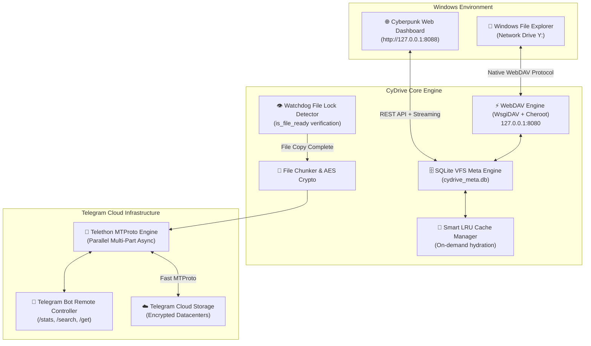

# 🚀 CyDrive

<div align="center">


### **Turn Telegram into an Infinite, Native Windows Hard Drive & Cyberpunk Cloud**
*Crafted with precision by the **[Cynet Security Team](https://cynetx.ir)***

[](https://github.com/icynetx/CyDrive/stargazers)
[](https://python.org)
[](https://telegram.org)
[](https://en.wikipedia.org/wiki/WebDAV)
[-00f3ff?style=for-the-badge)](http://127.0.0.1:8088)
[](LICENSE)

[Why CyDrive?](#-why-cydrive) • [Features](#-key-features) • [Quick Start](#-quick-start-in-3-minutes) • [Web Dashboard](#-cyberpunk-web-dashboard) • [How It Works](#-under-the-hood-how-it-works) • [FAQ & Troubleshooting](#-frequently-asked-questions--troubleshooting) • [راهنمای جامع فارسی](#-راهنمای-جامع-فارسی-cydrive)

</div>

---

## 💡 Why CyDrive?

Let's be honest: **Cloud storage subscriptions are expensive, and free tiers are painfully tiny.**
Google Drive gives you 15 GB (shared with your emails), Dropbox gives you a measly 2 GB, and OneDrive isn't much better.

Meanwhile, **Telegram provides virtually unlimited, free, and robust cloud storage across its global server infrastructure.** 
However, using Telegram as a cloud drive has always felt like a clunky hack:
- Dumping files into "Saved Messages" turns your chat into an unorganized, unsearchable digital attic.
- There are no nested folders, no subdirectories, and no native file tree.
- Uploading or downloading files requires manually clicking around in the app.

**CyDrive fixes all of that.** It bridges your private Telegram bot chat directly into **Windows File Explorer** as a real, mounted drive letter (like `Y:`). 

Drag and drop a 1.5 GB folder from your desktop into `Y:`, and CyDrive indexes the folder structure into an SQLite database, waits for Windows to finish copying, and uploads everything in the background via Telegram's MTProto protocol. Send a photo or document from your phone to your bot while commuting, and it will be waiting in your `Y:` drive when you get home.

---

## ⚡ Comparison: Why CyDrive Outclasses the Rest

| Feature | 📁 CyDrive (v2.0) | 📦 Google Drive / Dropbox | 💬 Telegram "Saved Messages" |
|---|---|---|---|
| **Storage Capacity** | **Unlimited (Free)** | 2 GB – 15 GB (Free limit) | Unlimited |
| **Windows Explorer Integration** | **Native Drive Letter (`Y:`)** | Requires Heavy Desktop Sync Client | ❌ None (Chat only) |
| **Zero Disk Bloat (On-Demand)** | ✅ Virtual VFS + LRU Cache | ⚠️ Partial (Smart Sync on paid plans) | ❌ Must download whole chat |
| **Max Single File Size** | **2 GB (or unlimited with chunking)** | 5 TB (Paid) / 15 GB | 2 GB (4 GB with TG Premium) |
| **Nested Folders & Tree Hierarchy** | ✅ SQLite VFS Index | ✅ Yes | ❌ No (Flat chat stream) |
| **Kernel Driver Required** | ❌ **No (Native WebDAV)** | ⚠️ Yes (Virtual FS drivers) | ❌ No |
| **Web Media Streaming UI** | ✅ Built-in Cyberpunk UI (`:8088`) | ✅ Standard Web UI | ⚠️ In-app player only |
| **Client-Side Zero-Knowledge Encryption** | ✅ Optional AES-256-GCM | ❌ Proprietary Server-side | ⚠️ Server-side MTProto |

---

## ✨ Key Features

- 🔄 **Real-Time Two-Way Sync:**
  - Drop any file or nested folder into your local `Y:` drive $\rightarrow$ auto-uploaded to Telegram.
  - Forward or upload any file to your Bot in Telegram $\rightarrow$ auto-downloaded and organized in your local drive.
- 📁 **Native Windows Virtual Drive (`Y:`):**
  - Appears inside **This PC** alongside your `C:` and `D:` drives.
  - Auto-mounts on launch and cleans up gracefully on exit.
- 🌐 **Cyberpunk Web Dashboard (`http://127.0.0.1:8088`):**
  - Dark glassmorphism UI with live storage gauge, real-time file counters, search bar, and drag-and-drop zone.
  - **In-browser Media Streaming:** Play MP4 videos, listen to FLAC/MP3 music, or view images without downloading them first.
- 🗄️ **SQLite WAL Metadata Engine:**
  - Maintains full directory paths, SHA-256 hashes, and Telegram message IDs.
  - Instant search across hundreds of thousands of files in milliseconds.
- 👁️ **Event-Driven File Watcher (`watchdog`):**
  - No CPU-burning polling loops.
  - Built-in `is_file_ready` lock verification: ensures large files (e.g. 1.8 GB video files) finish copying from Explorer before starting upload.
- 🧩 **Massive File Chunking (>2GB Limit Bypass):**
  - Automatically splits oversized files (5 GB, 20 GB+) into multi-part streams and seamlessly stitches them back together.
- 🤖 **Interactive Telegram Remote Bot:**
  - Control your drive from your smartphone: `/stats`, `/search <file>`, `/get <file>`, or drop files directly to sync.
- 🔐 **Zero-Knowledge AES-256-GCM Encryption (Optional):**
  - Encrypt files on your PC before transmission so that Telegram only ever sees encrypted blobs.

---

## 🏗️ Under the Hood: How It Works



---

## 🚀 Quick Start in 3 Minutes

### Step 1: Clone and Install
```bash
git clone https://github.com/icynetx/CyDrive.git
cd CyDrive
pip install -r requirements.txt
```

### Step 2: Grab Your Telegram Bot Credentials (30 seconds)
1. Open Telegram and search for [@BotFather](https://t.me/BotFather).
2. Send `/newbot`, choose a name and username, and copy your **Bot Token**.
3. Open [@userinfobot](https://t.me/userinfobot) and copy your **User ID / Chat ID**.

### Step 3: Launch CyDrive
```bash
python main.py
```
> On first launch, the interactive CLI wizard will prompt for your token and Chat ID, automatically optimize Windows registry settings, launch the WebDAV and Web UI servers, and mount drive **`Y:`** in Windows Explorer!

---

## 💻 CLI Commands & Power Tools

CyDrive comes with a unified command-line manager:

```bash
# Start all background engines, WebDAV, Web Dashboard, and Auto-Mount
python main.py run

# Mount the Windows Network Drive (e.g. Y:)
python main.py mount

# Safely unmount and disconnect the drive
python main.py unmount

# One-click Windows WebDAV registry optimization (removes 50MB file size limit)
python main.py fix-reg

# View quick storage analytics and file count in terminal
python main.py stats

# Re-run the interactive setup wizard
python main.py setup
```

---

## 🌐 Cyberpunk Web Dashboard

When CyDrive is running, open your web browser and visit:
👉 **`http://127.0.0.1:8088`**

```text
┌────────────────────────────────────────────────────────────────────────────┐
│  [■] CyDrive v2.0 • CYNET ENGINE                  [ Search files... ] 🔍   │
├────────────────────────────────────────────────────────────────────────────┤
│  📊 Total Files: 1,420    |  ☁️ Cloud Volume: 42.8 GB  |  🟢 MTProto: Online│
├────────────────────────────────────────────────────────────────────────────┤
│  [  Drag & Drop files here to instantly backup to Telegram Cloud  ]        │
├────────────────────────────────────────────────────────────────────────────┤
│  📄 Project_Final.mp4     │  1.42 GB  │  🟢 Synced  │  [Play] [Download]   │
│  📁 Source_Code_Archive   │  320 MB   │  🟢 Synced  │  [Open] [Download]   │
│  🖼️ Screenshot_2026.png   │  4.1 MB   │  🟢 Synced  │  [View] [Download]   │
└────────────────────────────────────────────────────────────────────────────┘
```

---

## 🎯 Practical Real-World Scenarios

1. 🎮 **Gamers & Content Creators:**
   Save 4K shadowplay recordings, OBS stream archives, and heavy video assets straight to `Y:`. They upload quietly in the background without eating your local SSD space.
2. 👨‍💻 **Developers & Power Users:**
   Keep offsite encrypted backups of your databases, Docker volumes, `.env` backups, and project archives with zero monthly cost.
3. 📱 **Seamless Phone $\leftrightarrow$ PC Bridge:**
   Take a photo on your phone, send it to your Telegram bot, and it's instantly inside your Windows PC's `Y:` drive without messy USB cables or third-party transfer apps.
4. 🍿 **Personal Media Streaming:**
   Drop your music and video library into CyDrive. Open `http://127.0.0.1:8088` from any device on your local network to stream media on demand.

---

## ❓ Frequently Asked Questions & Troubleshooting

<details>
<summary><strong>Q: Why does Windows show "File size exceeds the limit allowed" when copying files over 50 MB?</strong></summary>

By default, the Windows native WebDAV client imposes a legacy 50 MB single-file safety limit. 
CyDrive includes an automatic fix! Just run:
```bash
python main.py fix-reg
```
*(Or manually in PowerShell as Admin: `Set-ItemProperty -Path "HKLM:\SYSTEM\CurrentControlSet\Services\WebClient\Parameters" -Name "FileSizeLimitInBytes" -Value 4294967295 -Type DWord` and restart `WebClient` service).*
</details>

<details>
<summary><strong>Q: Can my Telegram account get banned for using CyDrive?</strong></summary>

**No.** CyDrive uses official Telegram Bot tokens and standard MTProto protocol through Telethon, strictly respecting Telegram's rate limits and FloodWait controls. It behaves just like any standard media backup bot.
</details>

<details>
<summary><strong>Q: What happens if I lose my internet connection during an upload?</strong></summary>

CyDrive's SQLite engine tracks the exact sync status of every file. If an upload is interrupted, the engine will automatically resume from where it left off once the connection is restored.
</details>

<details>
<summary><strong>Q: Does CyDrive fill up my local SSD/HDD?</strong></summary>

**No.** CyDrive uses a Smart LRU Cache Manager. Files in Telegram are indexed virtually. You can configure a maximum local cache limit (e.g. 10 GB), and CyDrive will automatically evict older local copies while keeping the cloud files untouched.
</details>

---

## 📁 Repository Structure

```text
CyDrive/
├── cydrive/
│   ├── __init__.py             # Package descriptor & version metadata
│   ├── cli.py                  # Rich terminal UI, service runner & diagnostics
│   ├── config.py               # Config dataclass, schema validation & wizard
│   ├── database.py             # SQLite WAL hierarchical VFS metadata engine
│   ├── crypto.py               # Zero-Knowledge AES-256-GCM encryption
│   ├── chunker.py              # Large file chunking (>2GB limit bypass)
│   ├── telegram_client.py      # Telethon MTProto async worker & remote bot
│   ├── watcher.py              # Watchdog real-time file event & lock watcher
│   ├── cache_manager.py        # Smart on-demand LRU cache & hydration
│   ├── webdav_server.py        # WsgiDAV & Cheroot WebDAV provider
│   ├── web_ui/                 # Cyberpunk Web Dashboard UI
│   │   ├── app.py              # aiohttp web server & REST API
│   │   ├── static/             # Cyberpunk styling (CSS) & Interactive logic (JS)
│   │   └── templates/index.html# Modern responsive dashboard
│   └── platform/
│       └── windows.py          # Auto registry tuner & Windows drive mounter
├── main.py                     # Primary execution entrypoint
├── tgdrive.py                  # Backward-compatible legacy runner
├── requirements.txt            # Python dependencies
├── config.example.json         # Configuration schema template
├── .gitignore                  # Git privacy & cache rules
├── LICENSE                     # MIT Open Source License
└── README.md                   # Complete documentation
```

---

## 🇮🇷 راهنمای جامع فارسی (CyDrive)

### 💡 چرا CyDrive ساخته شد؟
اکثر سرویس‌های ابری مثل گوگل درایو یا دراپ‌باکس حجم‌های رایگان بسیار محدودی دارند (۲ تا ۱۵ گیگابایت) و برای فضای بیشتر باید ماهانه هزینه اشتراک دلاری بپردازید. در مقابل، **سرورهای ابری تلگرام فضایی نامحدود، پرسرعت و رایگان** در اختیار کاربران قرار می‌دهند.

اما ذخیره فایل در بخش «Saved Messages» تلگرام مشکلات زیادی داشت:
* فایل‌ها بدون پوشه‌بندی و به شکل یک چت طولانی نامنظم ذخیره می‌شدند.
* دسترسی به آن‌ها از طریق کامپیوتر نیازمند باز کردن تلگرام، دانلود دستی و ذخیره مجدد بود.

**پروژه CyDrive این مشکل را یک‌بار برای همیشه حل کرده است.** این برنامه فضای چت تلگرام شما را به یک **درایو هارددیسک واقعی در ویندوز (مانند درایو `Y:`)** تبدیل می‌کند!

---

### ✨ قابلیت‌های اصلی نسخه ۲:
1. **💾 درایو بومی در This PC ویندوز:** اتصال مستقیم از طریق پروتکل WebDAV بدون نیاز به نصب درایورهای جانبی.
2. **🔄 همگام‌سازی دوطرفه (Two-Way Sync):** کشیدن فایل در درایو `Y:` ویندوز $\rightarrow$ آپلود آنی در تلگرام. ارسال فایل به ربات در تلگرام $\rightarrow$ ذخیره آنی در درایو کامپیوتر.
3. **🌐 پنل وب سایبرپانکی (`http://127.0.0.1:8088`):** دارای پلیر آنلاین ویدیو و موزیک، گالری تصاویر، سیستم جستجوی زنده و پنل آپلود کشیدنی-رهاکردنی (Drag & Drop).
4. **🗄️ موتور فراداده SQLite:** حفظ ساختار درختی پوشه‌ها و زیرپوشه‌ها و جلوگیری از سردرگمی در فایل‌ها.
5. **👁️ مانیتورینگ هوشمند فایل‌ها (`watchdog`):** بررسی پایدار شدن کپی فایل‌های سنگین و جلوگیری از آپلود ناقص.
6. **🧩 پشتیبانی از فایل‌های بسیار سنگین:** تقسیم خودکار فایل‌های بالای ۲ گیگابایت و اتصال مجدد آن‌ها هنگام دانلود.
7. **🤖 کنترل از راه دور با ربات تلگرام:** مدیریت فایل‌ها با دستورات `/stats`، `/search` و `/get` از روی گوشی.

---

### 🚀 نحوه راه‌اندازی سریع در ۳ مرحله:

```bash
# ۱. کلون ریپازیتوری و نصب وابستگی‌ها
git clone https://github.com/icynetx/CyDrive.git
cd CyDrive
pip install -r requirements.txt

# ۲. اجرای برنامه
python main.py
```
> در اولین اجرا، ویزارد خط فرمان توکن ربات (از [BotFather@](https://t.me/BotFather)) و Chat ID شما (از [userinfobot@](https://t.me/userinfobot)) را دریافت کرده، تنظیمات رجیستری ویندوز را اصلاح می‌کند و درایو `Y:` را در سیستم ماونت می‌نماید.

---

## 🤝 Contributing

Contributions, issues, and feature requests are welcome!
1. Fork the Repository
2. Create your Feature Branch (`git checkout -b feature/CoolFeature`)
3. Commit your Changes (`git commit -m 'feat: Add CoolFeature'`)
4. Push to the Branch (`git push origin feature/CoolFeature`)
5. Open a Pull Request

---

## 🛡️ License

This project is licensed under the **MIT License** - see the [`LICENSE`](LICENSE) file for details.

---

## 🌐 Community & Team

- **Developed by:** [Cynet Security Team](https://cynetx.ir)
- **Official GitHub:** [@icynetx](https://github.com/icynetx)
- **Repository:** [https://github.com/icynetx/CyDrive](https://github.com/icynetx/CyDrive)
- **Support & Inquiries:** [heyfiranam@gmail.com](mailto:heyfiranam@gmail.com)
