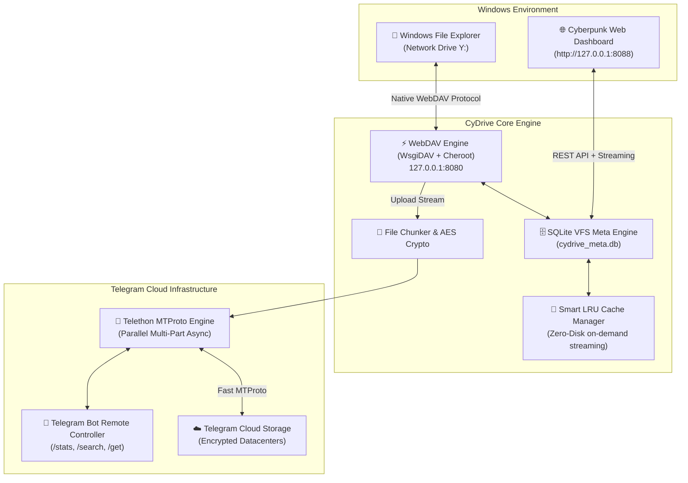
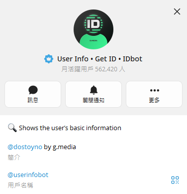

# 🚀 CyDrive

<div align="center">


### **把 Telegram 变成无限容量、Windows 原生挂载的云端硬盘**
*由 **[Cynet Security Team](https://cynetx.ir)** 开发*

[](https://github.com/thecynetx/CyDrive)
[](https://python.org)
[](https://telegram.org)
[](https://en.wikipedia.org/wiki/WebDAV)
[-00f3ff?style=for-the-badge)](http://127.0.0.1:8088)
[](LICENSE)

[📖 فارسی (波斯文)](README.fa.md) • [📖 English](README_EN.md) • [📖 繁體中文](README.md)

</div>

---

## 💡 为什么选择 CyDrive?

说实话:**国外云服务(Google Drive、Dropbox、OneDrive)的订阅很贵,免费容量又少得可怜。**
Google Drive 只给 15 GB(还跟 Gmail 共用),Dropbox 只有 2 GB,想要 TB 级空间每个月都得付高额费用。

另一方面,**Telegram 的服务器提供了几乎无限、免费、高速且极为稳定的云端空间。**
但传统上用 Telegram 当云端硬盘一直很麻烦:
- 把文件丢进「收藏夹(Saved Messages)」会让聊天室变成杂乱、无法搜索的仓库。
- Telegram 没有树状文件夹结构(Folder / Subfolder)。
- 每次要用文件都得打开 Telegram、手动下载、再存到电脑。

**CyDrive 彻底解决了这个问题。** 它把你的 Telegram 直接变成 **Windows 里一个真正的磁盘驱动器(例如 `Y:`)**!

只要把文件夹拖进 `Y:`,CyDrive 就会把目录结构记录到智能 SQLite 数据库,并通过高速 MTProto 协议上传到 Telegram。如果你人在外面,用手机把照片传给机器人,回家时照片已经躺在电脑的 `Y:` 里——**全程不占用你硬盘的任何 1 Byte!**

---

## ⚡ 完整比较:为什么 CyDrive 无可取代?

| 功能 | 📁 CyDrive(v2.0) | 📦 Google Drive / Dropbox | 💬 原生 Telegram(收藏夹) |
|---|---|---|---|
| **存储容量** | **无限且免费(Unlimited)** | 2 ~ 15 GB(免费) | 无限且免费 |
| **整合进 Windows 本机** | **独立盘符(`Y:`)** | 需要笨重的同步软件 | ❌ 没有(只能在聊天室里看) |
| **云端串流不占硬盘** | ✅ 即时串流(Zero-Disk) | ⚠️ 需付费方案(Smart Sync) | ❌ 必须整个下载 |
| **单文件大小上限** | **2 GB(Chunking 后无上限)** | 15 GB(免费)/ 5 TB | 2 GB(Premium 4 GB) |
| **树状嵌套文件夹** | ✅ SQLite 层级式数据库 | ✅ 有 | ❌ 没有(线性聊天流) |
| **需要笨重的内核驱动** | ❌ **不需要(Windows 原生 WebDAV)** | ⚠️ 需要(虚拟文件系统驱动) | ❌ 不需要 |
| **专属 Web 面板与播放器** | ✅ 赛博朋克风仪表盘(`:8088`) | ✅ 标准 Web UI | ⚠️ 只有 Telegram 内置播放器 |
| **客户端零知识加密** | ✅ 可选 AES-256-GCM | ❌ 服务器端私有加密 | ⚠️ MTProto 服务器加密 |

---

## ✨ 核心功能

- 🔄 **即时双向同步(Two-Way Sync):**
  把文件复制到 `Y:` → 后台自动上传 Telegram;在 Telegram 传文件给机器人 → 立刻出现在 `Y:` 与 Web 面板。
- 📁 **Windows 原生虚拟磁盘(`Y:`):**
  直接显示在文件资源管理器的 **此电脑** 中。启动时自动挂载(Mount),结束时自动卸载(Unmount)。
- 🌐 **赛博朋克 Web 仪表盘(`http://127.0.0.1:8088`):**
  深色玻璃拟态(Glassmorphism)界面、容量仪表、即时统计。
  **在线播放媒体:** 在浏览器直接看 MP4 视频、听 FLAC/MP3 音乐、看图片,不用先下载整个文件!
- 🗄️ **SQLite WAL 高性能元数据引擎:**
  记录树状目录结构、SHA-256 哈希与 Telegram 消息 ID,在数十万文件中搜索只需不到一毫秒。
- 👁️ **以 `watchdog` 监控文件系统事件:**
  接近零 CPU 占用(不使用笨重的 `os.walk` 轮询),内置文件稳定性检查(`is_file_ready`),避免复制到一半就上传残缺文件。
- 🧩 **超大文件自动分割(Chunking,超过 2 GB):**
  自动把 5 GB、20 GB、50 GB 的大文件切成标准分段上传,下载时无感重组。
- 🤖 **智能远程遥控机器人:**
  - `/stats` 查看云端总容量与文件数
  - `/search <文件名>` 快速搜索云端硬盘
  - `/get <文件名>` 直接下载文件到手机
- 🔐 **客户端加密(可选):**
  采用军规 AES-256-GCM 端到端加密,文件离开电脑前就已加密,连 Telegram 都看不到内容。

---

## 🛡️ 安全审计与修正(本 Fork 新增)

> 本 Fork([lp1688/CyDrive](https://github.com/lp1688/CyDrive))对上游 v2.0 全部代码进行了逐行安全审计,并修复了发现的漏洞。

### 审计结论:未发现木马或后门

- 全部约 2,300 行 Python 源代码、Web 面板的 JS/CSS/HTML 均经人工逐行审查:**没有混淆代码、没有隐藏的数据外泄通道、没有可疑的 `eval`/`exec`/`pickle`**。
- 对外网络行为只有两类,皆属正常:
  - Telegram MTProto(软件本体功能,经由 Telethon)
  - 查询本机公网 IP(`api.ipify.org` 等,仅在绑定 `0.0.0.0` 时用来显示网址)
- 所有子进程调用(`sc`、`net use`、`mount` 等)皆为硬编码指令,无命令注入风险。

### 已修复的漏洞

**1. WebDAV 与 Web 面板完全没有身份验证(高风险)**

原本 `webdav_server.py` 以 `{"*": True}` 匿名放行所有人;一旦绑定 `0.0.0.0`(例如 VPS),任何能连到 8080/8088 端口的人都能读取、上传、删除你整个云端硬盘。

**修复方式:**
- 新增 `web_username` / `web_password` 设置,首次启动自动生成随机密码并写入 `config.json`
- WebDAV 服务器启用 HTTP Basic + Digest 验证
- Web 面板全部路由(含静态文件)加入 Basic Auth 中间件,使用 `secrets.compare_digest` 防时序攻击
- Windows `net use` 挂载时自动携带凭据,无需手动输入

**2. Web UI 路径穿越(Path Traversal)**

原本 `/api/delete`、`/api/upload`、`/api/download` 直接把用户提供的文件名拼进文件路径,`../../` 可以逃逸缓存目录,删除或覆写系统上任意文件。

**修复方式:**
- 新增 `_sanitize_filename()`:先 URL 解码(拦截 `..%2F`、`%2e%2e%2f` 等混淆写法),再拒绝任何含 `..` 的路径段,最后只保留纯文件名;非法文件名一律返回 400
- 已新增对应的自动化测试(未授权访问、三种穿越攻击)

### 仍需注意的残留风险

- ⚠️ **上传失败会删除本机缓存文件**(`telegram_client.py` 的 Zero-Disk 设计):网络中断导致上传失败时,本机副本也会被删除。重要文件请先在 Telegram 确认上传成功。
- ⚠️ `fix-reg` 会修改注册表,把 WebClient 的 `BasicAuthLevel` 设为 2(允许明文 HTTP 上的 Basic 验证)、文件上限调到 4 GB,需要管理员权限。这是为了让 Windows 挂载可用,但属于弱化系统默认安全设置。
- ⚠️ 程序内嵌 Telegram 官方 Android 客户端的公开 `api_id`/`api_hash`(开源 Telethon 项目的常见做法),程序会对 Telegram 自称官方 Android 客户端,技术上违反 Telegram ToS。
- ⚠️ 若在 VPS 上绑定 `0.0.0.0`,Basic Auth 账号密码会走明文 HTTP,**强烈建议前面加一层 HTTPS 反向代理**(如 Caddy / Nginx)。
- ⚠️ Bot Token 等同机器人的完整控制权,外泄时请到 @BotFather 用 `/revoke` 立即更换,并更新 `config.json`。

---

## 🏗️ 系统架构与运作原理



---

## 🚀 零到一百完整安装教程

架设 CyDrive 只需要 5 分钟,请依序操作:

### 第一步:创建机器人并取得 Token(不到 1 分钟)
1. 打开 Telegram,进入官方机器人 **[@BotFather](https://t.me/BotFather)**。
2. 按 **Start**,然后发送 `/newbot`。
3. 输入机器人的**显示名称**(例如:`My Personal Drive`)。
4. 输入一个结尾是 `bot` 的**唯一用户名**(例如:`MyCloud_Fast_bot`)。
5. BotFather 会给你一串 Token,格式如下:

```text
7123456789:ABCdefGhIJKlmNoPQRstuVWXyz_123456
```

把它复制保存起来。

### 第二步:取得你的用户 ID(Chat ID)
1. 在 Telegram 进入 **[@userinfobot](https://t.me/userinfobot)**,按 **Start**。
2. 它会回复一串数字 ID(例如 `123456789`),这就是你的 **Chat ID**。
   (若没有回复,可改用 `@getmyid_bot` 或 `@JsonDumpBot`,认明官方机器人,小心冒名假账号。)

   **认明正确的官方机器人** —— 有蓝色验证勾勾、用户名为 `@userinfobot`;也可直接扫描 QR Code 前往:

   <div align="center">

   
   

   </div>
3. 最后,进入你刚创建的机器人对话,**按一次 Start**,机器人才有权限发消息给你。

### 第三步:下载项目并安装依赖

**🪟 Windows(PowerShell / CMD):**

```bash
git clone https://github.com/lp1688/CyDrive.git
cd CyDrive
pip install -r requirements.txt
python main.py
```

**🐧 Linux 服务器(Ubuntu 22+/24+、Debian 12+、CentOS VPS):**

```bash
# 安装前置需求
sudo apt update && sudo apt install -y python3 python3-pip python3-venv git

# 克隆并进入目录
git clone https://github.com/lp1688/CyDrive.git
cd CyDrive

# 方式一(建议,使用虚拟环境):
python3 -m venv venv
source venv/bin/activate
pip install -r requirements.txt
python3 main.py

# 方式二(直接安装到全系统):
pip install -r requirements.txt --break-system-packages --ignore-installed
python3 main.py
```

### 第四步:启动 CyDrive

* **第一次启动会发生什么?**
  1. 显示赛博朋克风的彩色终端画面
  2. 程序会询问你的 **Bot Token** 和 **Chat ID**
  3. Windows 会询问盘符(默认 `Y:`);Linux 会询问是否开放 VPS 外部访问 Web 面板
  4. 程序自动保存设置、生成 Web 访问密码、挂载云端磁盘并启动所有服务!

---

## ⚙️ 完整配置文件说明(`config.json`)

实际上只需手动填写 `bot_token` 与 `chat_id`,其余字段会在首次启动时自动以默认值补齐并存档:

```json
{
    "bot_token": "YOUR_TELEGRAM_BOT_TOKEN_HERE",
    "chat_id": 123456789,
    "api_id": 6,
    "api_hash": "eb06d4abfb49dc3eeb1aeb98ae0f581e",
    "storage_path": "C:\\work\\CyDrive\\Telegram_Drive",
    "cache_path": "C:\\work\\CyDrive\\Telegram_Cache",
    "db_path": "C:\\work\\CyDrive\\cydrive_meta.db",
    "webdav_host": "127.0.0.1",
    "webdav_port": 8080,
    "web_ui_host": "127.0.0.1",
    "web_ui_port": 8088,
    "enable_web_ui": true,
    "drive_letter": "Y:",
    "auto_mount_drive": true,
    "chunk_size_mb": 1900,
    "cache_limit_gb": 20,
    "encryption_password": null,
    "enable_encryption": false,
    "web_username": "admin",
    "web_password": ""
}
```

| 字段 | 说明 |
|---|---|
| `bot_token` | @BotFather 发的机器人 Token(**必填**) |
| `chat_id` | 你的 Telegram 数字 ID(**必填**) |
| `api_id` / `api_hash` | Telegram 客户端凭据,使用默认值即可 |
| `storage_path` | 本机暂存目录(上传缓冲用) |
| `cache_path` | 云端文件的本机 LRU 缓存目录 |
| `db_path` | SQLite 元数据数据库路径 |
| `webdav_host` / `webdav_port` | WebDAV 服务器监听地址(本机用 `127.0.0.1`) |
| `web_ui_host` / `web_ui_port` | Web 面板监听地址 |
| `enable_web_ui` | 是否启用 Web 面板 |
| `drive_letter` | Windows 挂载的盘符 |
| `auto_mount_drive` | 启动时是否自动挂载磁盘 |
| `chunk_size_mb` | 大文件分割大小(MB),默认 1900(低于 Telegram 2 GB 上限) |
| `cache_limit_gb` | 本机缓存上限(GB),超过会自动淘汰最久未用的文件 |
| `enable_encryption` / `encryption_password` | AES-256-GCM 加密开关与密码 |
| `web_username` / `web_password` | WebDAV/Web 面板登录账号密码;**留空会在首次启动时自动生成随机密码** |

> ⚠️ `config.json` 含有完整密钥,已列入 `.gitignore`,请勿上传到任何公开位置。

---

## 🐧 Linux 服务器上使用 CyDrive 的 3 种方式

Linux 没有「盘符」的概念,云端硬盘有 3 种使用方式:

### 1. 通过赛博朋克 Web 仪表盘(VPS 最简单的方式):
在任何设备(电脑或手机)打开浏览器,输入:
👉 **`http://你的服务器IP:8088`**
* **轻松上传:** 直接把文件拖进浏览器,就会存进 Telegram
* **在线播放:** MP4/MKV 视频、MP3/FLAC 音乐不用下载,直接从 Telegram 串流播放
* **即时搜索:** 按文件名在一秒内找到任何文件,一键下载

> ⚠️ 对外开放时请务必搭配 HTTPS 反向代理,保护 Basic Auth 账号密码。

### 2. 挂载为 Linux 本机云端文件夹(`~/CyDrive`):
安装 `davfs2` 后,会有一个连接到云端的专属文件夹 `~/CyDrive`:

```bash
# 安装 WebDAV 挂载工具
sudo apt install -y davfs2

# 启动 CyDrive(~/CyDrive 会自动挂载)
python3 main.py
```

所有 Linux 命令都可以直接对 Telegram 云端操作:

```bash
# 复制大文件到 Telegram 云端
cp /var/backups/database.tar.gz ~/CyDrive/

# 查看云端文件列表
ls -la ~/CyDrive/
```

### 3. 搭配 Rclone 做自动化备份:
标准 WebDAV 服务器运行在 `8080` 端口,可以用 **Rclone** 把它设置成一个无限容量的云端 remote:

```bash
# 设置 rclone
rclone config
# 类型: webdav | 网址: http://127.0.0.1:8080 | vendor: other | 账号密码同 config.json

# 自动同步网站或数据库目录到 Telegram:
rclone sync /var/www/html/ cydrive:/MySiteBackup/ -P
```

---

## 🌐 赛博朋克 Web 仪表盘

启动后打开浏览器,输入:
👉 **`http://127.0.0.1:8088`**(VPS 则用 `http://你的服务器IP:8088`)

账号密码会显示在启动时的终端状态表中,也存放在 `config.json` 的 `web_username` / `web_password` 字段。

<div align="center">


</div>

---

## 💻 命令行界面与 CLI 工具

<div align="center">


</div>

CyDrive 内置完整的命令行管理工具:

| 指令 | 功能说明 |
|---|---|
| `python main.py run` | 启动所有服务(WebDAV、Telegram、Web 面板、自动挂载磁盘) |
| `python main.py mount` | 挂载 Windows 网络磁盘(例如 `Y:`) |
| `python main.py unmount` | 安全卸载并移除 Windows 文件资源管理器中的网络磁盘 |
| `python main.py fix-reg` | 自动优化 Windows 注册表,解除 WebDAV 50 MB 单文件限制(提升至 4 GB) |
| `python main.py stats` | 在终端快速显示云端容量、文件数与数据库状态 |
| `python main.py setup` | 重新执行交互式设置向导,修改 Token 与设置 |

---

## 🔍 100% 诚实说明:为什么 Windows 显示的是我硬盘的容量?

很多用户挂载后会问:
> *「为什么 `Y:` 显示的是我原本硬盘的容量(例如 `总计 952 GB,剩余 263 GB`)?我的硬盘会被占用吗?」*

### 💡 工程上的解释(保证 0 Byte 占用):

1. **Windows 文件资源管理器的行为:**
   本机网络磁盘(`127.0.0.1`)由 Windows 内置的 `WebClient` 服务处理。Windows 对本机网络磁盘的默认行为,是依照主磁盘(`C:`)的容量来绘制容量条。
2. **文件实际存在哪里?**
   **100% 存在 Telegram 云端服务器。** 文件只会在传输的几秒钟内作为暂存缓冲,上传完成后**立即自动从硬盘删除**。
3. **自己动手验证:**
   - 记下 `C:` 的剩余空间(例如 `263.1 GB`)
   - 复制一个大文件(例如 500 MB 视频)到 `Y:`
   - 看到 `✅ [CLOUD UPLOAD] Successfully uploaded` 消息后,再检查 `C:` 容量
   - 你会发现 **`C:` 仍然刚好是 263.1 GB**,项目文件夹大小是 **0 Byte**!

---

## 🧪 自动化测试与品质验证

CyDrive 内置完整的自动化测试套件(含安全性测试):

```bash
# 执行所有集成与验证测试
python -m unittest discover tests
```

测试涵盖:大文件分割与 SHA-256 完整性、AES-256-GCM 加解密、SQLite VFS 元数据、LRU 缓存淘汰、WebDAV 虚拟资源、**Web API 身份验证与路径穿越防护**。

---

## ⚠️ 三个容易踩的坑(代码逐行核实,均属实)

1. **复制超过 50 MB 的文件会报错。**
   Windows WebDAV 客户端(WebClient)出厂默认单文件上限为 50 MB(`FileSizeLimitInBytes`)。以**管理员身份**执行一次 `python main.py fix-reg` 即可把上限提升到 4 GB。注意:程序启动挂载时也会尝试自动优化注册表,但若终端没有管理员权限会静默失败,此时大文件传输仍需手动以管理员身份补跑。
2. **`Y:` 磁盘显示的容量是错觉。**
   容量条显示的是主磁盘(`C:`)的剩余空间——这是 Windows 文件资源管理器对本机网络磁盘的默认渲染行为,与实际云端用量无关。(CyDrive 的 WebDAV 层其实有回报 10 TB 虚拟配额,但 Windows WebClient 会忽略它。)
3. **文件本体 100% 存在 Telegram 云端。**
   上传完成后本机暂存会立即删除,实测传完 1 GB 视频前后 `C:` 剩余空间分毫不动。但有两个例外要记住:**传输进行中**文件会暂时占用本机缓存;且**上传失败时本机副本会被一并删除**(Zero-Disk 设计的代价)——重要文件请先确认 Telegram 已收到。

**至于封号疑虑:** 本项目使用官方 Bot Token 与标准 Telethon(MTProto)客户端,代码对 FloodWait 速率限制有明确的自动等待处理(捕捉 `FloodWaitError` 后按秒数等待重试),账号风险确实很低。

---

## ❓ 常见问题与故障排除(FAQs)

<details>
<summary><strong>问:Windows 传输超过 50 MB 的文件时出现「File size exceeds the limit allowed」,怎么办?</strong></summary>

Windows 内置 WebDAV 客户端出厂默认把单文件传输限制在 50 MB。
只要执行一次以下指令即可完全解除:

```bash
python main.py fix-reg
```

*(或以管理员身份打开 PowerShell,执行 `Set-ItemProperty -Path "HKLM:\SYSTEM\CurrentControlSet\Services\WebClient\Parameters" -Name "FileSizeLimitInBytes" -Value 4294967295 -Type DWord`,然后重新启动 WebClient 服务。)*
</details>

<details>
<summary><strong>问:这个程序会占满我的电脑硬盘(C 盘)吗?</strong></summary>

**绝对不会!** CyDrive 的架构是基于**云端虚拟文件系统(Zero-Disk Cloud Streaming)**。所有文件只存在 Telegram,本机数据库只记录 ID 和大小等索引信息(0 Byte 硬盘占用)。只有在打开或播放文件时,内容才会即时在线串流,上传用的暂存也会立刻清除。
</details>

<details>
<summary><strong>问:我的 Telegram 账号会因为用这个工具被封禁吗?</strong></summary>

**不会。** 本工具使用 Telegram 官方 Bot Token 与基于 Telethon 的标准 MTProto 客户端。所有 Telegram 速率限制(FloodWait)都有被遵守,程序行为完全标准且合法。
</details>

<details>
<summary><strong>问:如果上传到一半网络断线怎么办?</strong></summary>

SQLite 引擎会记录所有文件状态。网络恢复后,未完成的文件会从中断点继续处理。
⚠️ 但请注意:目前版本在上传失败时也会删除本机暂存(Zero-Disk 设计),重要文件建议先确认 Telegram 中已存在再删除原始文件。
</details>

---

## 📁 项目文件结构

```text
CyDrive/
├── assets/                     # 横幅、Logo 与预览图
│   ├── banner.jpg
│   ├── logo.jpg
│   ├── web_dashboard.png
│   └── cli_preview.png
├── cydrive/
│   ├── __init__.py             # 模块信息与版本
│   ├── cli.py                  # 彩色命令行界面、协调器与状态表
│   ├── config.py               # 设置管理、验证与交互式向导(含 Web 凭据自动生成)
│   ├── database.py             # WAL 模式的 SQLite 层级式元数据引擎
│   ├── crypto.py               # AES-256-GCM 端到端加密引擎
│   ├── chunker.py              # 超过 2 GB 大文件分割模块
│   ├── telegram_client.py      # Telegram 异步 MTProto 客户端与机器人控制器
│   ├── watcher.py              # 文件系统即时事件监控与文件锁定检查
│   ├── cache_manager.py        # 智能 LRU 缓存系统(Zero-Disk)
│   ├── webdav_server.py        # 虚拟磁盘 WebDAV 服务器(含 Basic/Digest 验证)
│   ├── web_ui/                 # 赛博朋克 Web 仪表盘
│   │   ├── app.py              # 轻量 aiohttp 服务器与 REST API(含验证与路径穿越防护)
│   │   ├── static/             # CSS 样式与互动 JS
│   │   └── templates/index.html# 响应式面板模板
│   └── platform/
│       ├── windows.py          # Windows 注册表调整与磁盘自动挂载
│       └── linux_mac.py        # Linux 与 macOS 原生目录挂载
├── tests/                      # 自动化测试套件(含安全测试)
│   ├── test_all_features.py
│   └── test_web_ui.py
├── main.py                     # 程序主入口
├── tgdrive.py                  # 旧版兼容入口
├── requirements.txt            # Python 依赖清单
├── config.example.json         # 配置文件范例
├── .gitignore                  # Git 忽略规则
├── LICENSE                     # MIT 开源授权
├── README.fa.md                # 波斯文完整文档(原始上游语言)
├── README_EN.md                # 英文完整文档
├── README.md                   # 繁體中文完整文档
└── README.zh-CN.md             # 简体中文完整文档(本文件)
```

---

## 🤝 参与贡献(Contributing)

欢迎任何形式的贡献、回报 Bug 或新增功能!
1. Fork 本仓库
2. 创建你的功能分支(`git checkout -b feature/NewFeature`)
3. 提交你的修改(`git commit -m 'feat: Add NewFeature'`)
4. 推送到分支(`git push origin feature/NewFeature`)
5. 创建 Pull Request

---

## 🛡️ 授权条款

本项目采用 **MIT License** 开源授权。详情请参阅 [`LICENSE`](LICENSE) 文件。

---

## 🌐 联络我们与开发团队

- **开发者:** [Cynet Security Team](https://cynetx.ir)
- **上游仓库:** [https://github.com/thecynetx/CyDrive](https://github.com/thecynetx/CyDrive)
- **技术支持:** [norahsfavi@gmail.com](mailto:norahsfavi@gmail.com)
