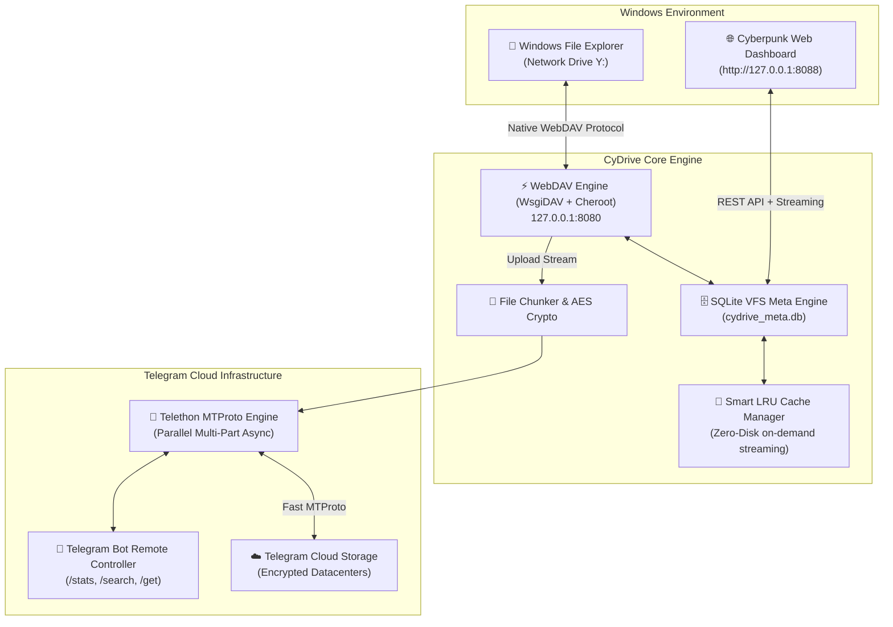

# 🚀 CyDrive

<div align="center">


### **Turn Telegram into an Infinite, Native Windows Hard Drive & Cyberpunk Cloud**
*Crafted with precision by the **[Cynet Security Team](https://cynetx.ir)***

[](https://github.com/thecynetx/CyDrive)
[](https://python.org)
[](https://telegram.org)
[](https://en.wikipedia.org/wiki/WebDAV)
[-00f3ff?style=for-the-badge)](http://127.0.0.1:8088)
[](LICENSE)

[📖 نسخه کامل فارسی (Persian)](README.md) • [Features](#-key-features) • [Setup Guide](#-0-to-100-step-by-step-setup-guide) • [Web Dashboard](#-cyberpunk-web-dashboard) • [How It Works](#-under-the-hood-how-it-works) • [Testing](#-automated-test-suite) • [FAQ](#-frequently-asked-questions--troubleshooting)

</div>

---

## 💡 Why CyDrive?

Let's be honest: **Cloud storage subscriptions are expensive, and free tiers are painfully tiny.**  
Google Drive gives you 15 GB (shared with emails), Dropbox gives you 2 GB, and OneDrive isn't much better.

Meanwhile, **Telegram provides virtually unlimited, free, and fast cloud storage across its global server infrastructure.**  
However, using Telegram as a cloud drive has always felt like a clunky hack:
- Dumping files into "Saved Messages" turns your chat into an unorganized, unsearchable digital attic.
- There is no hierarchical folder/subfolder tree.
- Opening or streaming media requires opening the Telegram client, manually downloading files, and hoarding local disk space.

**CyDrive bridges this gap.** It maps your Telegram bot directly to a **pure virtual network hard drive in Windows (e.g. `Y:`) and Linux mount (`~/CyDrive`)**!

Drag a multi-gigabyte project folder into `Y:` in Windows Explorer; CyDrive indexes the metadata in a lightweight SQLite database and streams the data asynchronously to Telegram over MTProto. Send a photo to your bot from your smartphone while away; it immediately appears on your desktop drive without cables or third-party sync apps — **all with Zero-Disk local footprint!**

---

## ⚡ Comparison: Why CyDrive Outperforms

| Feature | 📁 CyDrive (v2.0) | 📦 Google Drive / Dropbox | 💬 Raw Telegram (Saved Messages) |
|---|---|---|---|
| **Storage Capacity** | **Unlimited & Free** | 2 GB to 15 GB (Free tier) | Unlimited & Free |
| **Native OS Drive Integration** | **Direct Windows Drive Letter (`Y:`)** | Requires bloated desktop sync apps | ❌ None (Chat view only) |
| **Zero Local Disk Bloat** | ✅ On-Demand Virtual Streaming | ⚠️ Requires paid plans (Smart Sync) | ❌ Must download whole file |
| **Max File Size** | **2 GB (or Unlimited via Chunking)** | 15 GB (Free) / 5 TB | 2 GB (4 GB with Premium) |
| **Nested Folder Hierarchy** | ✅ SQLite Hierarchical VFS Engine | ✅ Yes | ❌ None (Flat linear chat) |
| **Kernel Driver Dependency** | ❌ **None (Native OS WebDAV)** | ⚠️ Yes (Virtual filesystem drivers) | ❌ None |
| **Web UI & Media Streaming** | ✅ Cyberpunk Modern Dashboard (`:8088`) | ✅ Standard Web UI | ⚠️ In-app media player only |
| **Client-Side Zero-Knowledge Encryption** | ✅ Optional Military-grade AES-256-GCM | ❌ Server-side proprietary encryption | ⚠️ Server MTProto encryption |

---

## ✨ Key Features

- 🔄 **Real-Time Two-Way Sync:**  
  Copy files to drive `Y:` $\rightarrow$ auto-uploaded to Telegram cloud. Send files to your Telegram bot $\rightarrow$ instant zero-byte appearance in `Y:`.
- 📁 **Native Windows Virtual Drive (`Y:`):**  
  Visible directly under **This PC** in Windows Explorer. Auto-mounts on launch, cleanly unmounts on shutdown.
- 🌐 **Cyberpunk Web Dashboard (`http://127.0.0.1:8088`):**  
  Futuristic glassmorphism UI with live cloud storage gauge, instant search, drag-and-drop upload zone, and in-browser streaming player for MP4 videos, FLAC/MP3 audio, and images.
- 🗄️ **High-Performance SQLite WAL Metadata Engine:**  
  Instant sub-millisecond lookups, directory hierarchy, SHA-256 integrity hashes, and Telegram message ID mapping.
- 🧩 **Multi-Part File Chunking (> 2GB):**  
  Splits files exceeding Telegram's single-file limits into numbered parts, automatically reassembling them seamlessly on download.
- 🔐 **Zero-Knowledge AES-256-GCM Encryption (Optional):**  
  Encrypt files client-side before they ever touch the network with authenticated Galois/Counter Mode cryptography.
- 🤖 **Interactive Telegram Remote Bot:**  
  Query storage statistics (`/stats`), search files (`/search <name>`), or download any file straight to your phone (`/get <name>`).

---

## 🏗️ Under the Hood: How It Works



---

## 🚀 0-to-100 Step-by-Step Setup Guide

Setting up CyDrive takes under 5 minutes:

### Step 1: Create a Telegram Bot (1 minute)
1. Open Telegram and message **[@BotFather](https://t.me/BotFather)**.
2. Send `/newbot`, choose a display name and a unique username ending in `bot`.
3. Copy your **Bot Token** (e.g. `7123456789:ABCdefGhIJKlmNoPQRstuVWXyz_123456`).

### Step 2: Get Your Chat ID
1. Message **[@userinfobot](https://t.me/userinfobot)** and press **Start**.
2. Note your numerical **Chat ID** (e.g. `123456789`).
3. Open your newly created bot chat and click **Start** so it has permission to message you.

### Step 3: Install & Launch

**🪟 On Windows:**
```bash
git clone https://github.com/thecynetx/CyDrive.git
cd CyDrive
pip install -r requirements.txt
python main.py
```

**🐧 On Linux Servers (Debian / Ubuntu / CentOS):**
```bash
sudo apt update && sudo apt install -y python3 python3-pip python3-venv git
git clone https://github.com/thecynetx/CyDrive.git
cd CyDrive
python3 -m venv venv
source venv/bin/activate
pip install -r requirements.txt
python3 main.py
```

### Step 4: First-Run Wizard
* CyDrive launches the interactive terminal wizard, prompts for your **Bot Token** and **Chat ID**, and auto-mounts your drive!

---

## 🐧 3 Ways to Use CyDrive on Linux Servers (VPS / Ubuntu / Debian / CentOS)

Linux does not use drive letters (like `Y:`). Instead, CyDrive delivers 3 flexible workflows:

### 1. Cyberpunk Web Dashboard (Easiest for Remote VPS):
Open your web browser from any desktop or mobile device:  
👉 **`http://YOUR_SERVER_IP:8088`**
* **Drag & Drop Upload:** Drop files directly into the browser to upload to Telegram cloud.
* **In-Browser Media Streaming:** Stream videos (MP4/MKV) and music (MP3/FLAC) without full local downloads.
* **Instant Search & Download:** Search through thousands of cloud files with instant download buttons.

### 2. Local Cloud Directory Mount (`~/CyDrive`):
Mount Telegram cloud directly into the Linux file hierarchy via `davfs2`:
```bash
# Install WebDAV mount driver
sudo apt install -y davfs2

# Launch CyDrive (auto-mounts ~/CyDrive)
python3 main.py
```

### 3. Rclone & Server Backup Automations:
Connect the active WebDAV server (`http://YOUR_SERVER_IP:8080`) to **Rclone** for scheduled cron backups:
```bash
# Setup rclone WebDAV remote
rclone config
# Type: webdav | URL: http://127.0.0.1:8080 | vendor: other

# Sync website or application folder to Telegram:
rclone sync /var/www/html/ cydrive:/Backup/ -P
```

---

## 🌐 Cyberpunk Web Dashboard

When CyDrive is running, open your web browser and visit:  
👉 **`http://127.0.0.1:8088`** (or `http://YOUR_SERVER_IP:8088` on a VPS)

<div align="center">


</div>

Features included in the Web Dashboard:
- 📊 **Live Storage Metrics:** Real-time volume gauge and file counters.
- 📁 **Interactive File Table:** Hierarchical browsing, file sizes, and download links.
- 🎬 **Built-in Media Streaming Player:** Stream MP4 videos, audio tracks, and photos without downloading.
- 📤 **Instant Drag-and-Drop Zone:** Upload files directly to Telegram cloud.
- 🔍 **Real-Time Search Bar:** Millisecond search across all your stored files.

---

## 💻 CLI Commands & Power Tools

<div align="center">


</div>

```bash
# Start all background engines, WebDAV, Web Dashboard, and Auto-Mount
python main.py run

# Mount the Windows Network Drive (e.g. Y:)
python main.py mount

# Safely unmount and disconnect the drive
python main.py unmount

# One-click Windows WebDAV registry optimization (removes 50MB file size limit)
python main.py fix-reg

# View quick storage analytics and file count in terminal
python main.py stats

# Re-run the interactive setup wizard
python main.py setup
```

---

## 🧪 Automated Test Suite

Run the full end-to-end unit and integration test suite:

```bash
python -m unittest discover tests
```

---

## 🔍 100% Transparent Technical Breakdown: Why Does Windows Explorer Show Local Disk Capacity?

A common question users ask when mounting the network drive:  
> *"Why does drive `Y:` show my host drive's capacity (e.g. `Total size: 952 GB, Free: 263 GB`)? Does it consume my hard drive?"*

### 💡 The Technical Explanation:
1. **Windows Explorer Visual Gauge:**  
   Windows Explorer's built-in `WebClient` network driver maps loopback network mounts (`127.0.0.1`) to the host disk's visual gauge.
2. **Where are files actually stored?**  
   **100% on Telegram Cloud servers.** On your machine, file data is streamed on-demand and upload buffers are **automatically and instantly deleted**.
3. **Verification Experiment:**
   - Note your free `C:` drive space (e.g. `263.1 GB`).
   - Copy a 1 GB video into `Y:`.
   - Once the upload completes, check your `C:` drive. Your free space remains identical (`263.1 GB`), and the CyDrive folder is **0 Bytes**!

---

## ❓ Frequently Asked Questions & Troubleshooting

<details>
<summary><strong>Q: Windows gives error "File size exceeds the limit allowed" when copying files > 50MB. How to fix?</strong></summary>

Windows WebDAV client defaults to a 50MB limit. Run this single command to unlock up to 4GB transfers:
```bash
python main.py fix-reg
```
</details>

<details>
<summary><strong>Q: Does CyDrive fill up my local SSD/HDD?</strong></summary>

**No, absolutely not.** CyDrive is built around **Pure Virtual Cloud Streaming**. Files live entirely on Telegram's servers. Local storage is 0 Bytes.
</details>

<details>
<summary><strong>Q: Can my Telegram account get banned?</strong></summary>

**No.** CyDrive uses the official Telegram Bot API and MTProto standard library (Telethon), strictly honoring rate limits (FloodWait).
</details>

---

## 📁 File Architecture

```text
CyDrive/
├── assets/                     # Banners, logos, and UI preview images
│   ├── banner.jpg
│   ├── logo.jpg
│   ├── web_dashboard.png
│   └── cli_preview.png
├── cydrive/
│   ├── __init__.py             # Package exports & version info
│   ├── cli.py                  # Terminal interface, coordination, status table
│   ├── config.py               # Config manager & first-time wizard
│   ├── database.py             # SQLite WAL hierarchical VFS metadata
│   ├── crypto.py               # AES-256-GCM zero-knowledge encryption
│   ├── chunker.py              # Multi-part chunking for files > 2GB
│   ├── telegram_client.py      # Async Telethon MTProto engine & bot handler
│   ├── watcher.py              # Real-time filesystem watcher
│   ├── cache_manager.py        # Smart on-demand LRU cache
│   ├── webdav_server.py        # Pure virtual WebDAV engine
│   ├── web_ui/                 # Cyberpunk Web Dashboard
│   │   ├── app.py              # aiohttp REST web service
│   │   ├── static/             # CSS styling and frontend JS
│   │   └── templates/index.html# Dashboard responsive HTML
│   └── platform/
│       ├── windows.py          # Windows registry & network mounter
│       └── linux_mac.py        # Linux & macOS mounter
├── tests/                      # Automated unit & integration tests
│   ├── test_all_features.py
│   └── test_web_ui.py
├── main.py                     # Main application entry point
├── tgdrive.py                  # Backward compatibility wrapper
├── requirements.txt            # Python dependencies
├── config.example.json         # Example configuration
├── .gitignore                  # Git ignore rules
├── LICENSE                     # MIT Open-Source License
├── README.md                   # Full Persian Documentation
└── README_EN.md                # Full English Documentation
```

---

## 🤝 Contributing

Contributions, bug reports, and feature requests are warmly welcomed!
1. Fork the repo.
2. Create your branch (`git checkout -b feature/CoolFeature`).
3. Commit your changes (`git commit -m 'feat: Add CoolFeature'`).
4. Push to the branch (`git push origin feature/CoolFeature`).
5. Open a Pull Request.

---

## 🛡️ License

This project is open-source software licensed under the **MIT License**. See [`LICENSE`](LICENSE) for details.

---

## 🌐 Connect With Us

- **Developed by:** [Cynet Security Team](https://cynetx.ir)
- **GitHub:** [@thecynetx](https://github.com/thecynetx)
- **Repository:** [https://github.com/thecynetx/CyDrive](https://github.com/thecynetx/CyDrive)
- **Email:** [norahsfavi@gmail.com](mailto:norahsfavi@gmail.com)
