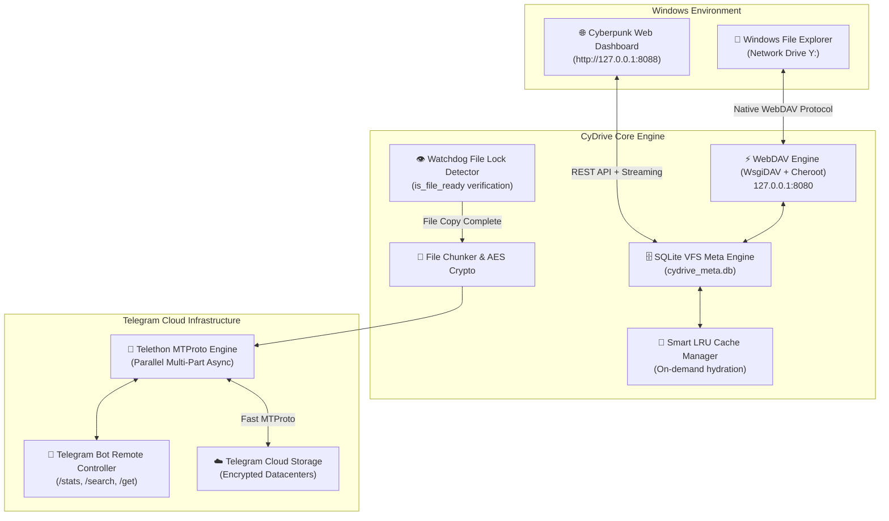

# 🚀 CyDrive

<div align="center">


### **Turn Telegram into an Infinite, Native Windows Hard Drive & Cyberpunk Cloud**
*Crafted with precision by the **[Cynet Security Team](https://cynetx.ir)***

[](https://github.com/icynetx/CyDrive/stargazers)
[](https://python.org)
[](https://telegram.org)
[](https://en.wikipedia.org/wiki/WebDAV)
[-00f3ff?style=for-the-badge)](http://127.0.0.1:8088)
[](LICENSE)

[📖 نسخه کامل فارسی (Persian)](README.md) • [Features](#-key-features) • [0-to-100 Setup Guide](#-0-to-100-step-by-step-setup-guide) • [Web Dashboard](#-cyberpunk-web-dashboard) • [How It Works](#-under-the-hood-how-it-works) • [FAQ & Troubleshooting](#-frequently-asked-questions--troubleshooting)

</div>

---

## 💡 Why CyDrive?

Let's be honest: **Cloud storage subscriptions are expensive, and free tiers are painfully tiny.**
Google Drive gives you 15 GB (shared with emails), Dropbox gives you 2 GB, and OneDrive isn't much better.

Meanwhile, **Telegram provides virtually unlimited, free, and fast cloud storage across its global server infrastructure.** 
However, using Telegram as a cloud drive has always felt like a clunky hack:
- Dumping files into "Saved Messages" turns your chat into an unorganized, unsearchable digital attic.
- There are no nested folders, no subdirectories, and no native file tree.
- Uploading or downloading files requires manually clicking around in the app.

**CyDrive fixes all of that.** It bridges your private Telegram bot chat directly into **Windows File Explorer** as a real, mounted drive letter (like `Y:`). 

Drag and drop a 1.5 GB folder from your desktop into `Y:`, and CyDrive indexes the folder structure into an SQLite database, waits for Windows to finish copying, and uploads everything in the background via Telegram's MTProto protocol. Send a photo or document from your phone to your bot while commuting, and it will be waiting in your `Y:` drive when you get home — **all with 0 bytes permanently consumed on your local hard drive!**

---

## ⚡ Comparison: Why CyDrive Outclasses the Rest

| Feature | 📁 CyDrive (v2.0) | 📦 Google Drive / Dropbox | 💬 Telegram "Saved Messages" |
|---|---|---|---|
| **Storage Capacity** | **Unlimited (Free)** | 2 GB – 15 GB (Free limit) | Unlimited |
| **Windows Explorer Integration** | **Native Drive Letter (`Y:`)** | Requires Heavy Desktop Sync Client | ❌ None (Chat only) |
| **Zero Disk Bloat (On-Demand)** | ✅ Virtual VFS + Pure Cloud Stream | ⚠️ Partial (Smart Sync on paid plans) | ❌ Must download whole chat |
| **Max Single File Size** | **2 GB (or unlimited with chunking)** | 5 TB (Paid) / 15 GB | 2 GB (4 GB with TG Premium) |
| **Nested Folders & Tree Hierarchy** | ✅ SQLite VFS Index | ✅ Yes | ❌ No (Flat chat stream) |
| **Kernel Driver Required** | ❌ **No (Native WebDAV)** | ⚠️ Yes (Virtual FS drivers) | ❌ No |
| **Web Media Streaming UI** | ✅ Built-in Cyberpunk UI (`:8088`) | ✅ Standard Web UI | ⚠️ In-app player only |
| **Client-Side Zero-Knowledge Encryption** | ✅ Optional AES-256-GCM | ❌ Proprietary Server-side | ⚠️ Server-side MTProto |

---

## ✨ Key Features

- 🔄 **Real-Time Two-Way Sync:**
  - Drop any file or nested folder into your local `Y:` drive $\rightarrow$ auto-uploaded to Telegram.
  - Forward or upload any file to your Bot in Telegram $\rightarrow$ auto-indexed and available in your local drive without eating local disk space.
- 📁 **Native Windows Virtual Drive (`Y:`):**
  - Appears inside **This PC** alongside your `C:` and `D:` drives.
  - Auto-mounts on launch and cleans up gracefully on exit.
- 🌐 **Cyberpunk Web Dashboard (`http://127.0.0.1:8088`):**
  - Dark glassmorphism UI with live storage gauge, real-time file counters, search bar, and drag-and-drop zone.
  - **In-browser Media Streaming:** Play MP4 videos, listen to FLAC/MP3 music, or view images without downloading them first.
- 🗄️ **SQLite WAL Metadata Engine:**
  - Maintains full directory paths, SHA-256 hashes, and Telegram message IDs.
  - Instant search across hundreds of thousands of files in milliseconds.
- 👁️ **Event-Driven File Watcher (`watchdog`):**
  - No CPU-burning polling loops.
  - Built-in `is_file_ready` lock verification: ensures large files finish copying from Explorer before starting upload.
- 🧩 **Massive File Chunking (>2GB Limit Bypass):**
  - Automatically splits oversized files (5 GB, 20 GB+) into multi-part streams and seamlessly stitches them back together.
- 🤖 **Interactive Telegram Remote Bot:**
  - Control your drive from your smartphone: `/stats`, `/search <file>`, `/get <file>`, or drop files directly to sync.
- 🔐 **Zero-Knowledge AES-256-GCM Encryption (Optional):**
  - Encrypt files on your PC before transmission so that Telegram only ever sees encrypted blobs.

---

## 🏗️ Under the Hood: How It Works



---

## 🚀 0-to-100 Step-by-Step Setup Guide

### Step 1: Obtain Your Telegram Bot Token (30 seconds)
1. Open Telegram and search for [@BotFather](https://t.me/BotFather).
2. Send `/newbot`.
3. Give your bot a display name (e.g. `My Cloud Drive`) and a unique username ending in `bot` (e.g. `MyCoolCloud_bot`).
4. BotFather will provide an **HTTP API Token** formatted like `1234567890:ABCdefGhIJKlmNoPQRstuVWXyz`. Keep this safe!

### Step 2: Obtain Your Telegram User ID / Chat ID
1. Open [@userinfobot](https://t.me/userinfobot) in Telegram and press **Start**.
2. It will reply with your numeric **Id** (e.g. `987654321`). This is your `chat_id`.
3. Open your new bot's chat and press **Start** (`/start`) so it has permission to message you.

### Step 3: Clone and Install Dependencies

**🪟 Windows (PowerShell / CMD):**
```bash
git clone https://github.com/icynetx/CyDrive.git
cd CyDrive
pip install -r requirements.txt
python main.py
```

**🐧 Linux & VPS Servers (Ubuntu 22+/24+, Debian 12+, CentOS VPS):**
```bash
sudo apt update && sudo apt install -y python3 python3-pip python3-venv git
git clone https://github.com/icynetx/CyDrive.git
cd CyDrive

# Method 1 (Recommended Virtual Environment):
python3 -m venv venv
source venv/bin/activate
pip install -r requirements.txt
python3 main.py

# Method 2 (Direct Fast Install on VPS):
pip install -r requirements.txt --break-system-packages
python3 main.py
```

**🍎 macOS:**
```bash
git clone https://github.com/icynetx/CyDrive.git
cd CyDrive
pip3 install -r requirements.txt
python3 main.py
```

### Step 4: Launch CyDrive

* On first launch, the interactive wizard asks for your **Bot Token** and **Chat ID**, saving them to `config.json`.
* CyDrive initializes the WebDAV cloud provider on port `8080`, launches the Cyberpunk Web Dashboard on port `8088`, connects to MTProto, and automatically mounts the virtual drive (`Y:` on Windows or `~/CyDrive` on Linux/macOS)!

---

## 💻 CLI Commands & Power Tools

```bash
# Start all background engines, WebDAV, Web Dashboard, and Auto-Mount
python main.py run

# Mount the Windows Network Drive (e.g. Y:)
python main.py mount

# Safely unmount and disconnect the drive
python main.py unmount

# One-click Windows WebDAV registry optimization (removes 50MB file size limit)
python main.py fix-reg

# View quick storage analytics and file count in terminal
python main.py stats

# Re-run the interactive setup wizard
python main.py setup
```

---

## 🌐 Cyberpunk Web Dashboard

When CyDrive is running, open your web browser and visit:
👉 **`http://127.0.0.1:8088`**

Features included in the Web Dashboard:
- 📊 **Live Storage Metrics:** Real-time volume gauge and file counters.
- 📁 **Interactive File Table:** Hierarchical browsing, file sizes, and download links.
- 🎬 **Built-in Media Streaming Player:** Stream MP4 videos, audio tracks, and photos without downloading.
- 📤 **Instant Drag-and-Drop Zone:** Upload files directly to Telegram cloud.
- 🔍 **Real-Time Search Bar:** Millisecond search across all your stored files.

---

## ❓ Frequently Asked Questions & Troubleshooting

## 🔍 100% Transparent Technical Breakdown: Why Does Windows Explorer Show Local Disk Capacity?

A common question when mapping a WebDAV network drive on Windows:  
> *«Why does the `Y:` drive display my physical hard drive's capacity (e.g., `Total size: 952 GB, Free: 263 GB`)? Is it consuming local disk space?»*

### 💡 The Engineering Truth (Zero-Disk Storage Guarantee):

1. **Windows WebClient Subsystem Behavior:**  
   Local WebDAV drives (`127.0.0.1`) in Windows are handled by the Windows kernel `WebClient` redirector. By default, Windows Explorer falls back to querying the host machine's drive (`C:`) to render the graphical capacity bar.
2. **Where are the files actually stored?**  
   **100% on Telegram Cloud.** On your local machine, incoming/outgoing files are buffered temporarily in memory/stream only during transmission and are **automatically and immediately deleted from your disk** the millisecond Telegram confirms receipt.
3. **Simple Proof Test (Verify for Yourself):**
   - Check your available space on drive `C:` (e.g., `263.1 GB free`).
   - Copy a large 500 MB or 1 GB file into your `Y:` virtual drive.
   - Wait for `✅ [CLOUD UPLOAD] Successfully uploaded` in console.
   - Re-check drive `C:` free space: **it remains exactly 263.1 GB (0 Bytes consumed)** and your project folder remains 0 Bytes.

---

## ❓ Frequently Asked Questions (FAQs)

<details>
<summary><strong>Q: I get "File size exceeds the limit allowed" when uploading files >50MB. How to fix?</strong></summary>

CyDrive includes an automatic fix! Just run:
```bash
python main.py fix-reg
```
*(Or manually in PowerShell as Admin: `Set-ItemProperty -Path "HKLM:\SYSTEM\CurrentControlSet\Services\WebClient\Parameters" -Name "FileSizeLimitInBytes" -Value 4294967295 -Type DWord` and restart `WebClient` service).*
</details>

<details>
<summary><strong>Q: Does CyDrive take up local hard drive space?</strong></summary>

**No, absolutely not.** CyDrive uses a Pure Virtual VFS. Files stored in Telegram are indexed as lightweight SQLite metadata (0 bytes on local disk). Files are streamed on-demand when accessed or played, and temporary upload buffers are instantly purged.
</details>

<details>
<summary><strong>Q: Can my Telegram account get banned for using CyDrive?</strong></summary>

**No.** CyDrive uses official Telegram Bot tokens and standard MTProto protocol through Telethon, strictly respecting Telegram's rate limits and FloodWait controls. It behaves just like any standard media backup bot.
</details>

---

## 📁 Repository Structure

```text
CyDrive/
├── cydrive/
│   ├── __init__.py             # Package descriptor & version metadata
│   ├── cli.py                  # Rich terminal UI, service runner & diagnostics
│   ├── config.py               # Config dataclass, schema validation & wizard
│   ├── database.py             # SQLite WAL hierarchical VFS metadata engine
│   ├── crypto.py               # Zero-Knowledge AES-256-GCM encryption
│   ├── chunker.py              # Large file chunking (>2GB limit bypass)
│   ├── telegram_client.py      # Telethon MTProto async worker & remote bot
│   ├── watcher.py              # Watchdog real-time file event & lock watcher
│   ├── cache_manager.py        # Smart on-demand LRU cache & hydration
│   ├── webdav_server.py        # Pure Virtual WebDAV provider
│   ├── web_ui/                 # Cyberpunk Web Dashboard UI
│   │   ├── app.py              # aiohttp web server & REST API
│   │   ├── static/             # Cyberpunk styling (CSS) & Interactive logic (JS)
│   │   └── templates/index.html# Modern responsive dashboard
│   └── platform/
│       └── windows.py          # Auto registry tuner & Windows drive mounter
├── main.py                     # Primary execution entrypoint
├── tgdrive.py                  # Backward-compatible legacy runner
├── requirements.txt            # Python dependencies
├── config.example.json         # Configuration schema template
├── .gitignore                  # Git privacy & cache rules
├── LICENSE                     # MIT Open Source License
├── README.md                   # Complete Persian Documentation
└── README_EN.md                # Complete English Documentation
```

---

## 🤝 Contributing

Contributions, issues, and feature requests are welcome!
1. Fork the Repository
2. Create your Feature Branch (`git checkout -b feature/CoolFeature`)
3. Commit your Changes (`git commit -m 'feat: Add CoolFeature'`)
4. Push to the Branch (`git push origin feature/CoolFeature`)
5. Open a Pull Request

---

## 🛡️ License

This project is licensed under the **MIT License** - see the [`LICENSE`](LICENSE) file for details.

---

## 🌐 Community & Team

- **Developed by:** [Cynet Security Team](https://cynetx.ir)
- **Official GitHub:** [@icynetx](https://github.com/icynetx)
- **Repository:** [https://github.com/icynetx/CyDrive](https://github.com/icynetx/CyDrive)
- **Support & Inquiries:** [heyfiranam@gmail.com](mailto:heyfiranam@gmail.com)
